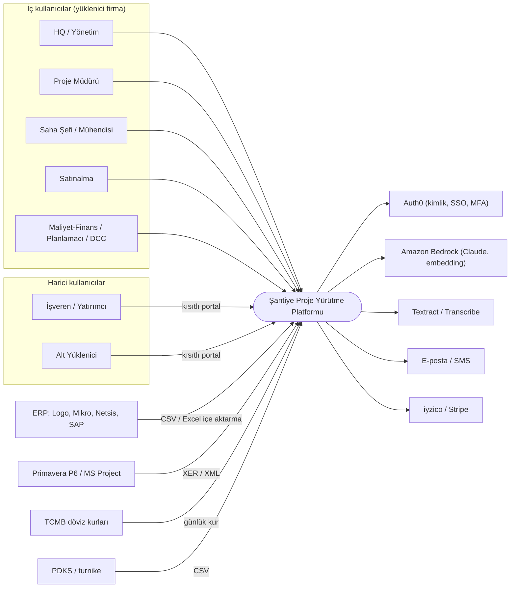
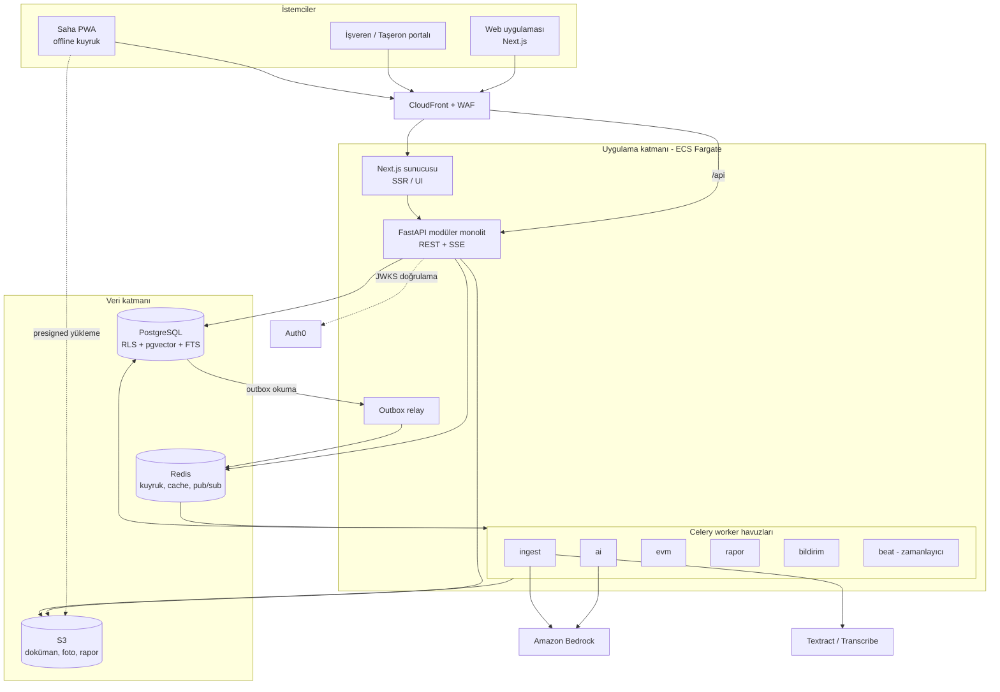
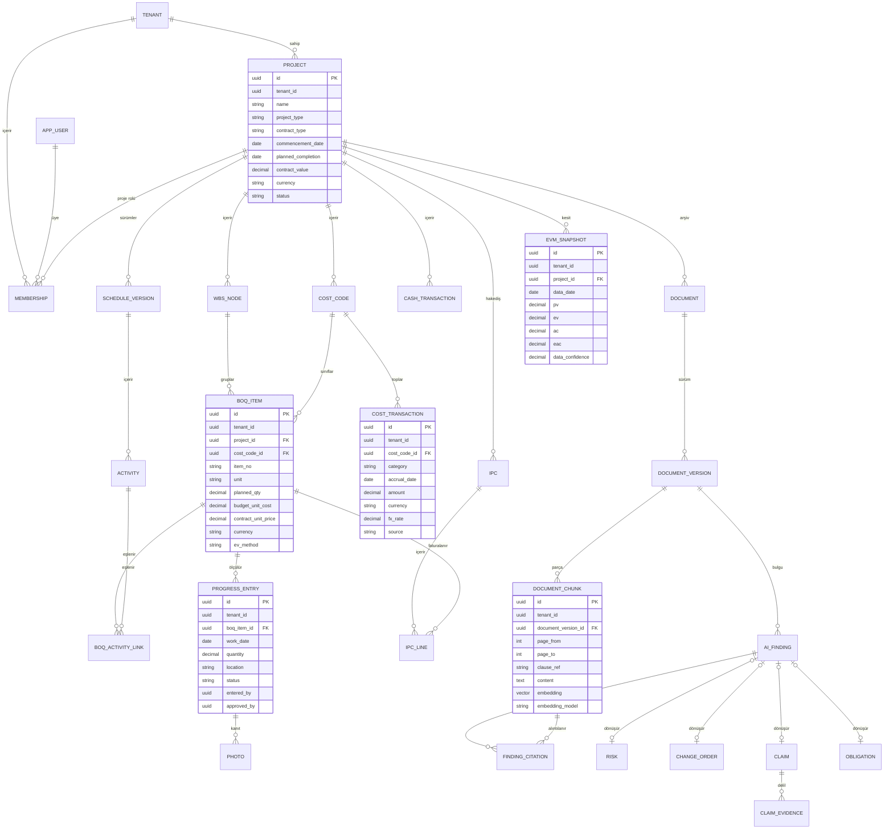
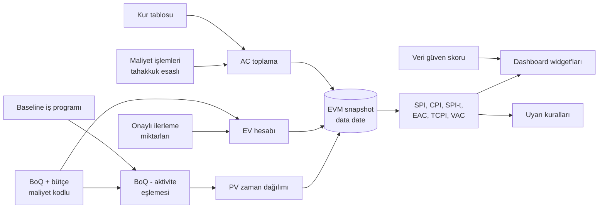
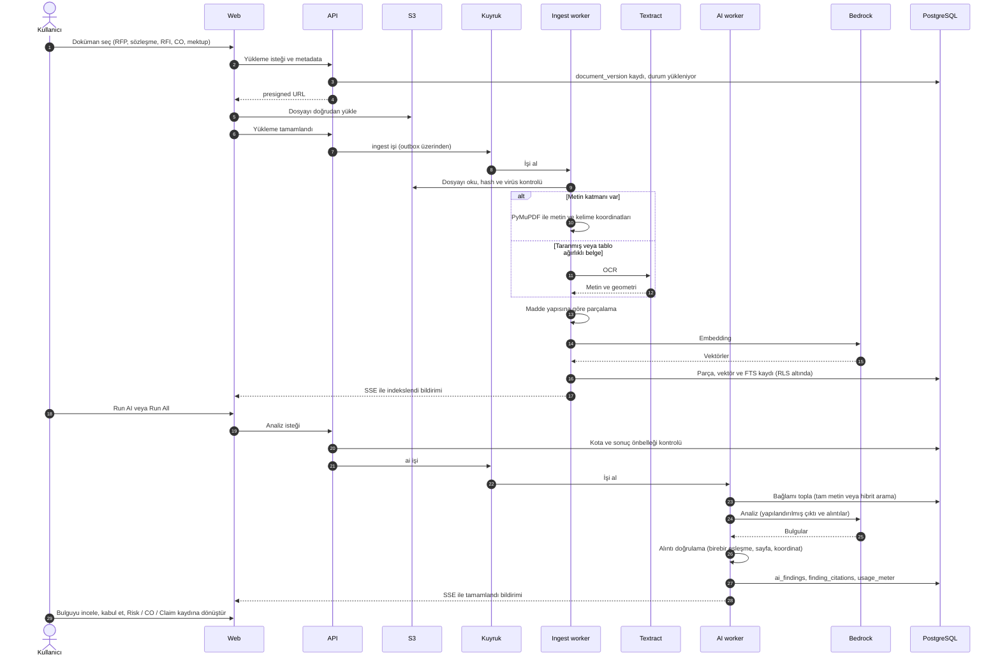
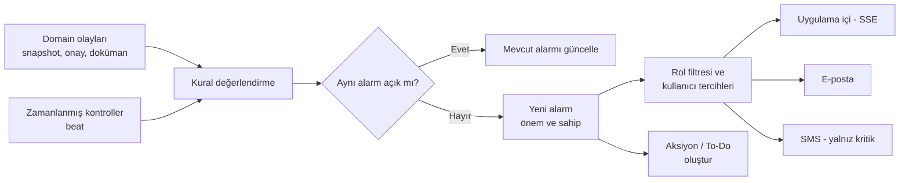
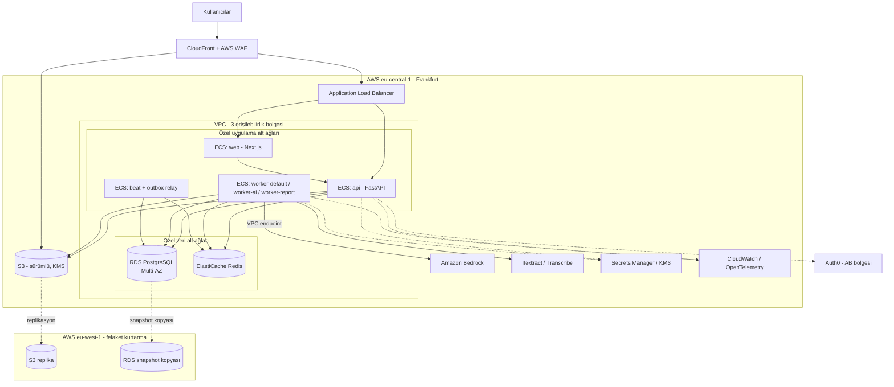
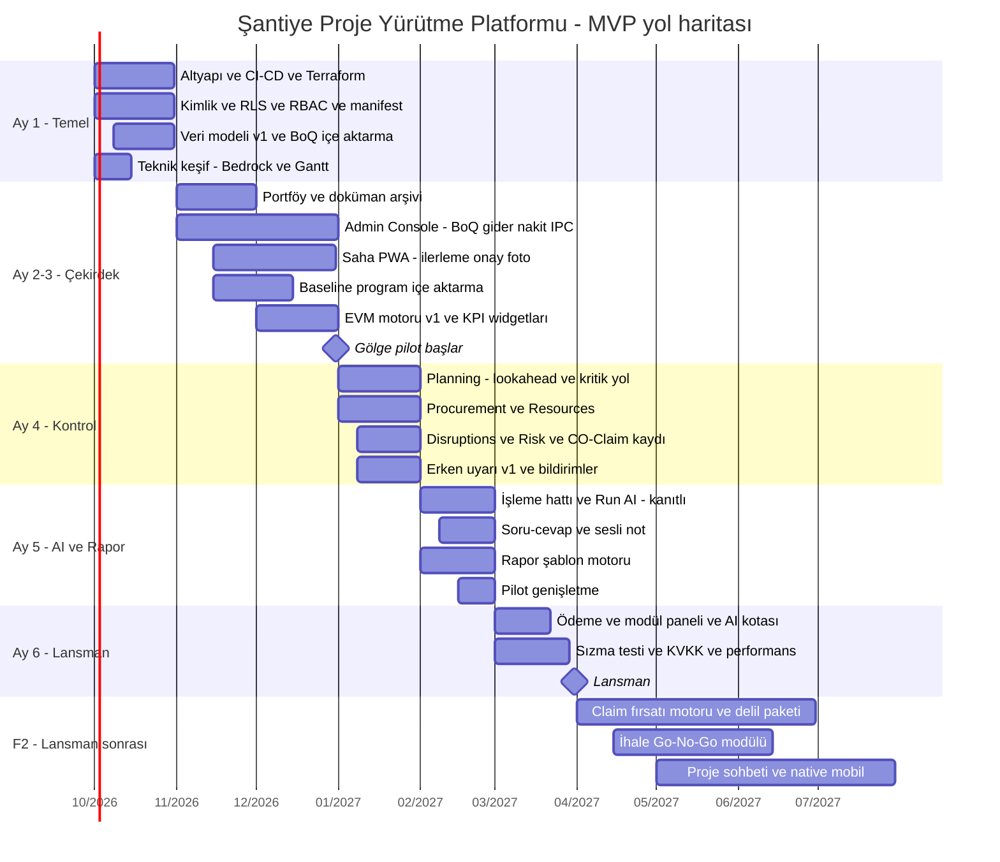

# Şantiye Proje Yürütme Platformu (SaaS) — Sistem Mimarisi

| | |
|---|---|
| **Sürüm** | v1.0 — ekip incelemesi için taslak |
| **Tarih** | 19 Eylül 2026 |
| **Dayanak belgeler** | PRD v3.0 (PDF ve Word), `ICCM Modulu.xlsx` wireframe'i, ContraVault AI demo izlenimleri |
| **Barındırma kararı** | AWS eu-central-1 (Frankfurt); LLM erişimi Amazon Bedrock üzerinden |

---

## İçindekiler

0. [Yönetici özeti](#0-yönetici-özeti)
1. [Kaynaklar ve kapsam](#1-kaynaklar-ve-kapsam)
2. [Mimari sürücüler](#2-mimari-sürücüler)
3. [Mimari ilkeler](#3-mimari-ilkeler)
4. [Sistem bağlamı](#4-sistem-bağlamı)
5. [Konteyner mimarisi](#5-konteyner-mimarisi)
6. [Modüler monolit ve modüller](#6-modüler-monolit-ve-modüller)
7. [Veri mimarisi](#7-veri-mimarisi)
8. [EVM ve proje kontrol motoru](#8-evm-ve-proje-kontrol-motoru)
9. [Sözleşme ve doküman zekâsı (kanıtlı AI)](#9-sözleşme-ve-doküman-zekâsı-kanıtlı-ai)
10. [Erken uyarı ve bildirim](#10-erken-uyarı-ve-bildirim)
11. [Çok kiracılık, kimlik ve yetkilendirme](#11-çok-kiracılık-kimlik-ve-yetkilendirme)
12. [Modül açma/kapama ve widget sistemi](#12-modül-açmakapama-ve-widget-sistemi)
13. [İstemci mimarisi](#13-istemci-mimarisi)
14. [Entegrasyonlar](#14-entegrasyonlar)
15. [Raporlama ve dışa aktarım](#15-raporlama-ve-dışa-aktarım)
16. [API tasarım kuralları](#16-api-tasarım-kuralları)
17. [Altyapı ve dağıtım](#17-altyapı-ve-dağıtım)
18. [Gözlemlenebilirlik ve işletim](#18-gözlemlenebilirlik-ve-işletim)
19. [Güvenlik ve KVKK](#19-güvenlik-ve-kvkk)
20. [Test stratejisi](#20-test-stratejisi)
21. [Yol haritası ve ekip](#21-yol-haritası-ve-ekip)
22. [PRD'den sapmalar](#22-prdden-sapmalar)
23. [Riskler, mimari kararlar ve açık konular](#23-riskler-mimari-kararlar-ve-açık-konular)
- [Ek A — Ekran izlenebilirlik tablosu (Log 1–81)](#ek-a--ekran-izlenebilirlik-tablosu)
- [Ek B — Rol × yetki matrisi](#ek-b--rol--yetki-matrisi)
- [Ek C — EVM formül sözlüğü](#ek-c--evm-formül-sözlüğü)
- [Ek D — Terimler](#ek-d--terimler)

---

## 0. Yönetici özeti

Platform; maliyet, imalat, nakit akışı, iş programı ve sözleşme verisini tek veri modelinde birleştirir. Bu veriden **deterministik bir EVM motoru** ile SPI/CPI ve tahminler üretir. Sözleşme ve yazışmalardan da **kaynağa bağlı (kanıtlı)** risk, yükümlülük, değişiklik emri (CO) ve claim bulguları çıkarır.

Ana mimari kararlar:

| # | Karar | Kısa gerekçe |
|---|---|---|
| 1 | **Modüler monolit** (tek FastAPI kod tabanı + ayrı worker süreçleri) | 4,5 kişilik ekip ve 6 ay mikroservis işletimini kaldırmaz; modül sınırları sonradan servis ayırmaya izin verir |
| 2 | **PostgreSQL: ortak şema + `tenant_id` + Row-Level Security** | Kiracı izolasyonunu veritabanı garanti eder; migration ve vektör indeksi tek yerde kalır |
| 3 | **Hesap deterministik, AI yorumlar** | EVM ve hakediş hesaplarını LLM yapmaz; AI yalnızca yapılandırılmamış veriyi yapılandırır ve yorumlar |
| 4 | **Kanıt sözleşmesi** | Her AI bulgusu doküman sürümü, sayfa ve birebir doğrulanmış alıntı taşır; doğrulanamayan bulgu varsayılan olarak gösterilmez |
| 5 | **Amazon Bedrock (EU) üzerinde Claude**, görev bazlı model yönlendirme | Veri AB'de kalır; riskli analizlerde güçlü model, yüksek hacimli işlerde hızlı model |
| 6 | **Modül manifesti** (paket ∩ kiracı ∩ proje ∩ rol) | Modüller deploy olmadan canlıda açılıp kapanır (PRD Adım 6.3) |
| 7 | **Offline çalışan saha PWA'sı** ve veri güven skoru | Veri girilmezse model de anlamsızlaşır (GIGO, PRD 3.2); giriş kolay olmalı, eksik veri görünür olmalı |
| 8 | **AWS ECS Fargate + RDS + S3**, Terraform | Sunucu yönetimi yok; küçük ekip işletebilir |

MVP (Ay 1–6) çekirdeği: portföy, doküman arşivi, Admin Console (BoQ, gider, nakit), ilerleme ve fotoğraf, EVM, planlama, satınalma, aksaklıklar, erken uyarı, kanıtlı sözleşme analizi ve raporlama. **Claim fırsatı motoru** (doküman olayı + kritik yol gecikmesi + maliyet aşımı + hak doğuran madde) lansman sonrası ilk büyük farklılaştırıcıdır. Bu özellik sözleşme ile saha verisini birleştirdiği için yalnızca sözleşmeye odaklanan araçlarda (ör. ContraVault) yoktur.

---

## 1. Kaynaklar ve kapsam

| Kaynak | İçerik | Mimariye etkisi |
|---|---|---|
| **PRD v3.0** (PDF = Word) | Vizyon, UI akışı, 6 adımlı kurulum, teknoloji önerileri, dış servisler, riskler (GIGO, AI maliyeti), ekip, 6 aylık plan | Kapsam, roller, yığın ve takvim çerçevesi |
| **ICCM Modulu.xlsx** | 13 wireframe sayfası; "Log" sayfasında 81 numaralı ekran açıklaması, "Genel" ve "Gelecek" satırları | Modül sınırları, ekran → API eşlemesi (Ek A) |
| **ContraVault AI izlenimleri** | Go/No-Go kontrolleri, çelişki analizi, soru/düzeltme önerileri, özet, riskler, maddeye atıflı arama, yan yana PDF görünümü | Sözleşme AI'ı için beklenen kullanıcı deneyimi ve kalite çıtası |

Wireframe numaraları ekranlarla şöyle eşleşir: Home 1–15, ProjeCreate 16–17, ProjectData 18–30, ProjectHome 31–45, AdminC 46–55, Progress 56–60, Planning 61–65, Reports 66–68, Procurement 69–72, Risks 73–76, Disruptions 77–81.

**Kapsam dışı (bu belgede):** UI görsel tasarımı, fiyatlandırma, hukuki metinler. Bunlara yalnızca mimariyi etkiledikleri ölçüde değinilir.

---

## 2. Mimari sürücüler

### 2.1 İşlevsel sürücüler

1. **Tek veri omurgası:** BoQ, maliyet kodu, iş programı aktivitesi ve ilerleme birbirine bağlı olmalı; aksi halde EVM hesaplanamaz.
2. **Erken uyarı:** SPI/CPI, nakit, kritik yol ve sözleşmesel süre sınırları için eşik bazlı alarm.
3. **Kanıtlı doküman analizi:** RFP, sözleşme, RFI, CO ve mektuplardan kaynağa bağlı risk ve fırsat çıkarımı.
4. **Modüler ürün:** Abonelik paketi ve role göre dinamik ekran ve widget'lar.
5. **Saha kullanılabilirliği:** Zayıf bağlantıda mobil veri girişi, fotoğraf ve ses.
6. **Çok taraflı erişim:** İşveren ve alt yüklenici kendi kısıtlı görünümünü görür.
7. **Her ekranın dışa aktarılması:** Excel, Word ve PDF (Log 5–7), kurumsal antetli raporlar.

### 2.2 Kalite nitelikleri (hedefler)

| Nitelik | Hedef |
|---|---|
| Kiracı izolasyonu | Uygulama hatasında bile başka kiracının verisi okunamaz (DB seviyesinde RLS) |
| Doğruluk | EVM sonuçları, domain uzmanının elle hesapladığı test vakalarıyla kuruşu kuruşuna eşleşir |
| İzlenebilirlik | Her kayıt değişikliği ve her AI bulgusu kaynağına kadar izlenebilir |
| Performans | Dashboard p95 < 500 ms; yazma API'leri p95 < 300 ms; 300 sayfalık PDF'in indekslenmesi < 10 dk; tek doküman analizi < 5 dk |
| Erişilebilirlik | %99,5 (aylık); planlı bakım dışında |
| Dayanıklılık | RPO 15 dk, RTO 4 saat |
| Offline | Saha uygulaması en az 3 günlük girişi çevrimdışı tutabilir |
| AI maliyeti | Kiracı ve kullanıcı bazında ölçülebilir ve sınırlandırılabilir |
| Yerelleştirme | TR/EN arayüz; çoklu para birimi |

### 2.3 Kısıtlar

- **Ekip:** 1 domain uzmanı/ürün yöneticisi, 1 kıdemli backend, 1 kıdemli frontend, yarı zamanlı AI mühendisi, 1 QA. Ayrı bir DevOps rolü yok.
- **Süre:** 6 ayda lansman.
- **Mevzuat:** KVKK; müşteri sözleşmelerinin gizliliği.
- **Barındırma:** AWS Frankfurt.

### 2.4 Ölçek varsayımları (ilk 2 yıl; pilotla doğrulanacak)

| Boyut | Varsayım |
|---|---|
| Kiracı (firma) | 50–300 |
| Kiracı başına aktif proje | 5–50 |
| Proje başına BoQ kalemi | 2.000–20.000 |
| Proje başına aktivite | 1.000–10.000 |
| Proje başına günlük ilerleme girişi | 50–300 |
| Proje başına günlük fotoğraf | 50–500 (depolama maliyetinin ana kalemi) |
| Proje başına doküman sayfası | 5.000–50.000 → ~50–500 bin parça (chunk) |
| Eşzamanlı kullanıcı | 200–2.000 |

Bu ölçek tek bir iyi boyutlandırılmış PostgreSQL örneğinde rahatça yönetilir; dağıtık veritabanı gerekmez.

---

## 3. Mimari ilkeler

1. **Modüler monolit, mikroservis değil.** Modüller bounded context olarak ayrılır, birbirlerinin tablolarına doğrudan yazmaz ve servis arayüzü veya domain olayı ile konuşur. Ağır işler aynı kodla ayrı worker süreçlerinde çalışır.
2. **Hesap deterministik, AI yorumlar.** SPI/CPI/EAC, hakediş ve metraj karşılaştırması saf kodla hesaplanır ve test edilir. LLM finansal tablolara doğrudan yazamaz; önerisi insan onayıyla kayda dönüşür.
3. **Kanıtsız bulgu yok.** AI çıktısı doküman, sürüm, sayfa ve alıntı taşır. Alıntı kaynak metinde doğrulanamazsa bulgu "doğrulanmamış" olarak işaretlenir ve varsayılan olarak gösterilmez.
4. **İzolasyon veritabanında.** Kiracı filtresi uygulama kodunun iyi niyetine bırakılmaz; RLS ile zorlanır.
5. **Önce saha.** Veri girişi mobil, offline ve hızlıdır. Eksik veri gizlenmez; KPI'ların yanında "veri güven skoru" gösterilir.
6. **Her şey modül.** Hangi ekran ve widget'ın açık olacağına paket, kiracı, proje ve rol birlikte karar verir. Modül açmak veri değişikliğidir, deploy değildir.
7. **Değiştirilemez geçmiş.** EVM snapshot'ları, audit log ve doküman sürümleri üzerine yazılmaz; düzeltmeler yeni kayıtla yapılır.
8. **Sağlayıcıdan bağımsız AI katmanı.** Model ve embedding seçimi yapılandırmadır; prompt'lar sürümlüdür ve değerlendirme setiyle test edilir.

---

## 4. Sistem bağlamı



---

## 5. Konteyner mimarisi



| Konteyner | Teknoloji | Sorumluluk |
|---|---|---|
| Web uygulaması | Next.js (App Router), TypeScript | Masaüstü ofis kullanımı: dashboard, tablolar, Gantt, PDF görüntüleyici |
| Saha PWA | Aynı Next.js kod tabanı, PWA + IndexedDB | Offline ilerleme girişi, fotoğraf, sesli not, onay |
| İşveren/Taşeron portalı | Aynı uygulama, kısıtlı rol ve ayrı DTO'lar | İlerleme, onaylı raporlar, kendi hakedişleri; iç maliyet görünmez |
| Next.js sunucusu | Node.js (ECS) | SSR, oturum (Auth0 SDK), API'ye token iletimi |
| API | Python 3.12, FastAPI, SQLAlchemy 2 | İş kuralları, yetki, OpenAPI, SSE (iş ilerlemesi ve bildirim) |
| Outbox relay | Python süreci | DB'deki `outbox` tablosundan olayları kuyruğa aktarır (transaction güvenli) |
| Worker havuzları | Celery + Redis | `ingest` (OCR, parçalama, embedding), `ai` (analiz), `evm` (hesap ve snapshot), `rapor` (PDF/DOCX/XLSX), `bildirim`, `beat` (zamanlı işler) |
| PostgreSQL | RDS, Multi-AZ, pgvector | İlişkisel veri, vektör arama, tam metin arama, outbox |
| Redis | ElastiCache | Kuyruk, önbellek, SSE için pub/sub, rate limit |
| S3 | Sürümlü, KMS şifreli | Doküman sürümleri, fotoğraflar, üretilen raporlar |

---

## 6. Modüler monolit ve modüller

### 6.1 Modül haritası

Faz etiketleri: **A1** = Ay 1, **A2–3**, **A4**, **A5**, **A6** = lansman; **F2** = lansman sonrası 6–12 ay; **F3** = 12+ ay.

| Modül | Ekran / Log no | Sorumluluk | Faz |
|---|---|---|---|
| `platform` | Giriş, 1, 8, 9, 12 | Kiracı, kullanıcı, üyelik, rol/yetki, modül manifesti, audit, abonelik, AI kotası, yardım | A1 (yardım A6) |
| `portfolio` | 2–4, 10–17, 25–26 | Home, Projects, Tenders listeleri; durumlar (Ongoing, On Hold, Completed, Terminated, Cancelled); proje tipi (Commercial, Leasing, Service, Manpower…); ihaleden projeye dönüşüm | A2–3 |
| `documents` | 11, 20–22, 24, Genel | Klasörlü arşiv, sürümleme, yükleyen/tarih/konum, DCC yetkisi, önizleme | A2–3 |
| `commercial` | 46–48, 53–54, AdminC sağ paneli | BoQ (aktivite ve maliyet kodlu), bütçe, IPC (işveren/taşeron), sözleşme kayıtları, CO/claim kayıtları, direkt/endirekt/finansal giderler (teminat ve kredi komisyonları), nakit giriş/çıkış/bakiye | A1–A4 |
| `progress` | 56–59 | BoQ koduna göre imalat girişi ve amir onayı, saha fotoğrafları, ilerleme panosu | A2–3 |
| `evm` | 27–30, 41–45 | PV/EV/AC, SPI/CPI, SPI(t), EAC/ETC, S-eğrisi, snapshot'lar, KPI widget'ları, veri güven skoru | A2–3 |
| `planning` | 61–65 | P6/MS Project içe aktarma; baseline/current/revised sürümleri; 2 haftalık lookahead; kritik yol; baseline çakıştırma; sapma ve telafi önerisi | A2–3 (baseline) / A4 |
| `resources` | 50–52 | Adam-saat (PDKS destekli, şef onaylı, aktiviteye dağıtılmış), ana firma/taşeron personeli, iş makinesi ve yakıt | A4 |
| `procurement` | 69–72 | SAS (satınalma talebi → sipariş), depo ve stok hareketleri | A4 |
| `risk_disruption` | 73–81 | Saha ve sözleşme risk kaydı; verimsizlik (adam-saat/makine-saat kaybı, boşta kaynak); malzeme kaybı (SAS ↔ tüketim ↔ imalat); aksiyonlar | A4 (AI desteği F2) |
| `alerts` | tümü | Erken uyarı kuralları, alarm yaşam döngüsü, bildirim tercihleri | A4 |
| `collab` | 40, 55 | Notlar / To-Do / aksiyon talebi (A4); proje sohbeti ve doküman paylaşımı (F2) | A4 / F2 |
| `contract_ai` | 23–24, 47–48, 53–54, 74, 79 | İşleme hattı, Run AI / Run All, özet, risk, çelişki, yükümlülük ve süre sınırı, soru-cevap; CO/claim fırsatı ve delil paketi (F2); ihale Go/No-Go (F2) | A5 / F2 |
| `reporting` | 5–7, 49, 66–68 | Ekranlardan dışa aktarma, rapor şablonları, taslak ve önizleme, zamanlanmış raporlar | A2–3 (dışa aktarma) / A5 |
| `integrations` | — | İçe aktarma sihirbazları (BoQ, ERP maliyet, program, PDKS), TCMB kurları, ödeme sağlayıcıları | A1–A6 |

81 maddenin tek tek eşlemesi [Ek A](#ek-a--ekran-izlenebilirlik-tablosu)'dadır.

### 6.2 Modül kuralları

1. Her modülün **kendi tabloları** vardır; başka bir modül bu tablolara yazmaz, yalnızca modülün servis arayüzünü çağırır veya olayını dinler.
2. Modüller arası okuma, açık bir sorgu arayüzü (ör. `evm.get_latest_snapshot(project_id)`) ile yapılır.
3. Modül bağımlılıkları tek yönlüdür ve CI'da **import-linter** ile zorlanır. Örneğin `evm`, `commercial` ve `progress`'i okur; tersi yasaktır.
4. Durum değişiklikleri **domain olayı** üretir; olay aynı transaction içinde `outbox` tablosuna yazılır ve kaybolmaz.
5. Uzun süren işler (OCR, AI, EVM yeniden hesaplama, rapor üretimi) her zaman worker'a gider; API isteği içinde yapılmaz.

### 6.3 Önerilen repo yapısı (monorepo)

```
/backend
  app/
    core/            # config, db oturumu, tenancy (RLS), auth, izinler, olaylar/outbox, hata modeli
    modules/
      platform/  portfolio/  documents/  commercial/  progress/  evm/  planning/
      resources/  procurement/  risk_disruption/  alerts/  collab/  contract_ai/  reporting/  integrations/
        api.py          # FastAPI router'ları (require_module / require_perm guard'ları)
        schemas.py      # Pydantic DTO'lar (iç ve harici rol için ayrı)
        service.py      # iş kuralları
        models.py       # SQLAlchemy modelleri
        repository.py   # sorgular
        events.py       # yayınlanan/dinlenen domain olayları
        tasks.py        # Celery görevleri
  migrations/           # Alembic
  tests/
/frontend
  app/                  # Next.js App Router (rota haritası §13.1)
  components/ui/        # shadcn/ui
  components/widgets/   # dashboard widget kaydı
  lib/api/              # OpenAPI'den üretilen tipli istemci
  lib/offline/          # IndexedDB kuyruğu, senkronizasyon
/infra
  terraform/            # VPC, ECS, RDS, ElastiCache, S3, CloudFront, WAF, IAM, KMS
/docs
  adr/                  # mimari karar kayıtları
```

### 6.4 Temel domain olayları

| Olay | Üreten | Tüketenler |
|---|---|---|
| `ProgressEntryApproved` | progress | evm (yeniden hesap), alerts |
| `CostTransactionPosted` | commercial | evm, alerts (nakit projeksiyonu) |
| `ScheduleVersionImported` | planning | evm (PV yeniden dağıtımı), alerts (float) |
| `EvmSnapshotCreated` | evm | alerts, reporting |
| `DocumentVersionUploaded` | documents | contract_ai (ingest) |
| `DocumentIndexed` | contract_ai | contract_ai (kiracı ayarına göre otomatik analiz), alerts |
| `FindingAccepted` | contract_ai | risk_disruption / commercial (Risk, CO, Claim kaydı), alerts (yükümlülük → son tarih) |
| `ObligationTriggered` | commercial / risk_disruption | alerts (süre sınırı geri sayımı) |
| `ModuleEntitlementChanged` | platform | tüm istemciler (manifest yenileme) |

---

## 7. Veri mimarisi

### 7.1 Çekirdek veri modeli

EVM'in omurgası **WBS ↔ maliyet kodu ↔ BoQ kalemi ↔ iş programı aktivitesi** bağıdır. BoQ kalemi ile aktivite arasında ağırlıklı, çoka-çok bir eşleme vardır: bir kalem birden çok aktiviteye yayılabilir, bir aktivite birden çok kalem içerebilir. EVM'in doğruluğu bu eşlemeye bağlı olduğu için **proje kurulum sihirbazı** ve **eşleme kapsama oranı** birinci sınıf özelliklerdir.



**Tablo grupları (modül sahipliğiyle):**

| Modül | Tablolar |
|---|---|
| platform | tenants, app_users, memberships, roles, role_permissions, module_catalog, plan_modules, tenant_modules, project_modules, subscriptions, usage_meter, audit_log |
| portfolio | projects, tenders, project_settings |
| commercial | wbs_nodes, cost_codes, boq_items, budgets, cost_transactions, cash_transactions, ipcs, ipc_lines, contracts, subcontracts, change_orders, claims, claim_evidence, obligations |
| progress | progress_entries, photos, daily_diaries |
| planning | schedule_versions, activities, activity_relationships, calendars, boq_activity_links |
| evm | pv_timephased, evm_snapshots, evm_snapshot_lines |
| resources | manpower_logs, equipment, equipment_logs, fuel_logs |
| procurement | purchase_requests, purchase_orders, stock_items, stock_movements |
| risk_disruption | risks, disruption_events, actions |
| documents | folders, documents, document_versions |
| contract_ai | document_chunks, ai_jobs, ai_findings, finding_citations, analysis_criteria, prompt_versions |
| alerts | alert_rules, alerts, notification_preferences, notifications |
| reporting | report_templates, report_instances, export_jobs |
| core | outbox |

### 7.2 Konvansiyonlar

- **Kimlik:** Uygulamada üretilen UUIDv7. Sıralanabilir olduğu için indeks dostudur.
- **Her kiracı tablosunda** `tenant_id NOT NULL` ve RLS politikası bulunur (§11.1).
- **Denetim alanları:** `created_at`, `created_by`, `updated_at`, `updated_by`. Değişikliklerin ayrıntısı `audit_log` tablosuna yazılır.
- **Onaylı kayıtlar değiştirilemez:** Onaylanmış ilerleme girişi, kesilmiş hakediş veya snapshot düzeltilmek istenirse ters kayıt ya da yeni sürüm açılır.
- **Optimistik eşzamanlılık:** Düzenlenebilir kayıtlarda `version` sütunu tutulur; API `If-Match`/ETag ile çakışmayı yakalar.
- **Silme:** Kiracı verisinde yumuşak silme (`deleted_at`) uygulanır; kalıcı silme yalnızca kiracı çıkışında ve saklama süresi dolduğunda yapılır.

### 7.3 Para, kur ve miktar

- Tutarlar `NUMERIC(18,4)`, miktarlar `NUMERIC(18,6)` tipindedir; **float kullanılmaz**. Python tarafında `Decimal` kullanılır.
- Her parasal kayıtta **orijinal tutar ve para birimi**, **işlem günü kuru** (TCMB, günlük içe aktarma) ve **proje raporlama dövizindeki karşılığı** saklanır.
- Bütçe, **bütçe kuru** ile sabitlenir. Böylece kur hareketi ile verimlilik ayrıştırılabilir (§8.5).
- Fiyat farkı / eskalasyon hesabı F2 kapsamındadır; veri modeli buna açık tutulur (endeks tabloları ve formül parametreleri).

### 7.4 Dosya depolama

- S3 anahtar yapısı: `tenant/{tenant_id}/project/{project_id}/{kind}/{yyyy}/{mm}/{uuid}.{ext}`. `kind` değerleri: `documents`, `photos`, `reports`, `imports`.
- Yükleme istemciden doğrudan S3'e **presigned POST** ile yapılır; boyut ve MIME sınırları imzada tanımlanır.
- S3 sürümleme açıktır. Doküman sürümleri ayrıca `document_versions` tablosunda SHA-256 hash ile tutulur; aynı içerik tekrar analiz edilmez.
- Kötü amaçlı yazılım taraması GuardDuty S3 Malware Protection veya worker içinde ClamAV ile yapılır.
- Fotoğraflar için küçük resim ve önizleme worker'da üretilir; EXIF (GPS, zaman) ayrıştırılıp kayda eklenir.

### 7.5 Veri yaşam döngüsü

| Veri | Sıcak | Arşiv | Silme |
|---|---|---|---|
| Proje işlem verisi | Proje süresince | Proje kapanışından sonra salt okunur | Sözleşmedeki saklama süresi sonunda veya kiracı talebiyle |
| Fotoğraflar | 12 ay S3 Standard | S3 Standard-IA, sonra Glacier Instant Retrieval | Kiracı politikasına göre |
| Doküman sürümleri | Proje süresince | Proje kapanışından sonra IA | Kiracı politikasına göre |
| Audit log | 2 yıl DB | S3'e aylık dışa aktarım (değiştirilemez) | Yasal süreye göre |
| AI çağrı izleri | 90 gün | — | 90 gün sonra silinir (içerik); maliyet metrikleri tutulur |

---

## 8. EVM ve proje kontrol motoru

### 8.1 Hesap akışı



EVM hesapları `evm` worker'ında çalışır. Onaylı veri olayları proje başına **debounce** edilir (ör. son olaydan 2 dk sonra tek hesap). Ayrıca günlük, haftalık ve aylık kesitler `beat` ile zamanlanır.

### 8.2 PV — planlanan değer

- Her BoQ kaleminin bütçe maliyeti (`planned_qty × budget_unit_cost`), eşleme ağırlıklarıyla aktivitelere dağıtılır.
- Aktivite bütçesi, baseline başlangıç ve bitiş tarihleri arasında **çalışma takvimine göre** zamana yayılır. Varsayılan doğrusal dağılımdır; aktivite bazında ön yüklü, arka yüklü veya S eğrisi seçilebilir.
- Sonuç `pv_timephased` tablosunda (baseline sürümü, dönem, maliyet kodu, aktivite, tutar) saklanır. Yeni baseline içe aktarıldığında yeniden üretilir; eski baseline'ın PV'si korunur.

### 8.3 EV — kazanılmış değer

- **Miktar bazlı (varsayılan):** EV = kalem bütçesi × min(onaylı kümülatif miktar ÷ planlanan miktar, 1). Planlanan miktar aşılırsa **metraj aşımı** ayrıca işaretlenir; bu aşım CO/claim adayıdır.
- **Miktar ölçülemeyen işler** (mobilizasyon, tasarım, test) kalem bazında `ev_method` ile tanımlanır: 0/100, 50/50, kilometre taşı ağırlıkları veya sorumlu mühendisin % tamamlanma beyanı (onaylı).
- **Yalnızca onaylı ilerleme** EV'ye girer (Log 57 onay akışı). Onay bekleyen miktar ayrıca "doğrulanmamış EV" olarak gösterilebilir.

### 8.4 AC — gerçekleşen maliyet

- AC **tahakkuk esaslıdır** (`accrual_date`). Nakit akışı (ödeme tarihi) ayrı izlenir; ikisi karıştırılmaz.
- Kaynaklar: gider girişi ve ERP içe aktarması, taşeron hakedişleri, satınalma siparişi ve mal kabulü, personel ve makine maliyetleri, finansal giderler (teminat ve kredi komisyonları).
- Maliyet kodu olmayan işlem "kodlanmamış" havuzda kalır. Proje toplamına girer, kalem bazında EVM'e girmez ve veri güven skorunu düşürür.
- **Direkt, endirekt ve finansal** gider ayrımı (PRD 3.1) raporlarda ayrı gösterilir. EVM varsayılan olarak direkt ve endirekt maliyeti kapsar; finansal giderlerin dahil edilmesi proje ayarıdır.

### 8.5 Göstergeler ve tahminler

| Gösterge | Tanım | Ekrandaki yeri |
|---|---|---|
| SPI, CPI, SV, CV | Standart EVM (Ek C) | ProjectData KPI (Log 27), dashboard |
| **SPI(t)** — Earned Schedule | Zaman bazlı performans; SPI'nın proje sonunda 1'e yakınsama sorununu giderir | Planning ve dashboard |
| Geçen süre ve ilerleme yüzdesi | Commencement date'ten bu yana geçen süre ile fiziksel ilerleme karşılaştırması | Log 28 |
| **EAC — tahmini maliyet** | Seçilebilir yöntem: BAC/CPI; AC + (BAC − EV); AC + (BAC − EV)/(CPI × SPI) | Log 29 ("Estimation Cost") |
| **Tamamlanma maliyeti — birim fiyat yöntemi** | Kalem bazında: gerçekleşen + kalan miktar × gerçekleşen ortalama birim maliyet | Log 30 ("Cost of Completion") |
| ETC, VAC, TCPI | Kalan maliyet, tamamlanmada sapma, hedef için gereken verimlilik | Dashboard ve raporlar |
| Bugünkü maliyet | AC | ProjectData "Cost As Of Today" |

**Birim fiyat yöntemi için koruma:** Kalemde gerçekleşen miktar çok küçükse (ör. < %10) gerçekleşen birim maliyet yanıltıcı olur. Bu durumda bütçe birim maliyeti kullanılır ve kullanıcıya belirtilir.

**İki mercek:**
- **Maliyet merceği:** bütçe maliyetine göre EVM (yönetim ve maliyet kontrolü).
- **Gelir merceği:** sözleşme birim fiyatlarıyla kazanılmış hakediş, faturalanan hakediş (IPC) ve tahsilat. Hakedilmiş ama faturalanmamış tutar da bu mercekte görünür.

**Kur etkisinin ayrılması:** CPI iki şekilde raporlanır. **Sabit kur CPI**, AC'nin bütçe kuruyla hesaplanmasıyla bulunur ve verimliliği gösterir. **Raporlanan CPI** gerçekleşen kurla hesaplanır. Aradaki fark "kur etkisi" olarak ayrı gösterilir. Böylece TL'nin değer kaybı saha verimsizliği gibi görünmez.

### 8.6 Snapshot'lar

- Her hesap **data date** ile etiketlenir ve `evm_snapshots` + `evm_snapshot_lines` (maliyet kodu ve WBS kırılımı) tablolarına yazılır.
- Dönem kesitleri (haftalık/aylık) **kilitlenir**. Geçmiş dönem verisi sonradan düzeltilirse yeni bir "düzeltilmiş" snapshot üretilir; orijinal kesit korunur.
- Dashboard ve raporlar snapshot'tan okur. Bu sayede hızlıdırlar ve raporlanan rakam sonradan değişmez.
- S-eğrileri (PV/EV/AC kümülatif) ve trendler bu seriden çizilir.

### 8.7 Veri güven skoru

Her KPI'nın yanında A/B/C rozeti olarak gösterilir ve PRD'deki GIGO riskine doğrudan cevap verir:

| Bileşen | Ölçü |
|---|---|
| Maliyet kodlama oranı | Kodlanmış AC ÷ toplam AC |
| Eşleme kapsaması | Aktiviteye eşlenmiş BAC ÷ toplam BAC |
| İlerleme tazeliği | Devam eden aktivitelerde son onaylı girişten bu yana geçen gün (medyan) |
| Program tazeliği | Son program güncellemesinin data date'inden bu yana geçen gün |
| Onay birikimi | Onay bekleyen giriş sayısı ve yaşı |

Ağırlıklar proje ayarıdır. Varsayılan eşikler pilotta domain uzmanıyla kalibre edilir.

---

## 9. Sözleşme ve doküman zekâsı (kanıtlı AI)

### 9.1 İşleme hattı ve "Run AI" akışı



**Adımlar:**

1. **Metin çıkarma:** Metin katmanı olan PDF'lerde PyMuPDF kullanılır (kelime bazında koordinat verir). Taranmış veya tablo ağırlıklı belgelerde Amazon Textract (Tesseract yedek). Word/Excel dosyaları doğrudan ayrıştırılır. Sayfa numarası, koordinat ve başlık hiyerarşisi korunur.
2. **Doküman sınıflandırma:** Tip (sözleşme, özel şartlar, şartname, RFI, CO, mektup, tutanak, çizim), tarih, taraflar ve referans numarası küçük ve hızlı bir modelle çıkarılır; kullanıcı düzeltebilir.
3. **Madde bazlı parçalama:** Sözleşme numaralandırması tanınır ("3.3 (c)", "20.1", "Madde 12.4"). Parçalar madde sınırında kesilir; çok uzun maddeler örtüşmeli alt parçalara bölünür. Her parça `clause_ref`, `page_from/to` ve koordinatları taşır.
4. **Embedding:** Bedrock'taki çok dilli bir embedding modeli kullanılır (ör. Cohere Embed Multilingual veya Titan Text Embeddings V2). Seçim, Türkçe ve İngilizce sözleşme örnekleriyle yapılan bir retrieval testine göre A1'de yapılır. Model adı her parçada saklanır; model değişirse arka planda yeniden embedding yapılır.
5. **Çizimler (DWG):** MVP'de yalnızca saklama ve PDF/SVG önizleme. Çizim okuma ("Genel" satırı) F3 kapsamındadır.

### 9.2 Arama

- **Hibrit arama:** pgvector HNSW (kosinüs) ile Postgres tam metin araması (`tsvector`; Türkçe ve İngilizce yapılandırma) birlikte kullanılır; sonuçlar reciprocal rank fusion ile birleştirilir. Madde numarası geçen sorgularda (ör. "20.1") doğrudan madde eşleşmesi önceliklidir.
- **Filtreler:** Kiracı (RLS), proje, doküman tipi, sürüm (varsayılan en güncel) ve tarih aralığı. pgvector'ın filtreli sorgularda iterative index scan desteği (0.8+) kullanılır.
- **Ölçek:** Proje başına yüzbinlerce parça pgvector için rahat bir büyüklüktür. On milyonlarca parçaya çıkıldığında proje bazlı bölümleme (partitioning) veya ayrı vektör deposu yeniden değerlendirilir.

### 9.3 Bağlam stratejisi

| Durum | Strateji | Neden |
|---|---|---|
| Tek sözleşme üzerinde risk, çelişki, yükümlülük, Go/No-Go | **Tam bağlam:** sözleşmenin tamamı modele verilir (güncel Claude modellerinde 1M token bağlam), aynı sözleşmeye yapılan analizlerde **prompt caching** kullanılır | Çelişki bulmak için maddeler arası tüm ilişkiler görülmeli; parçalı arama çelişkiyi kaçırabilir |
| Birden çok doküman üzerinde soru-cevap, yazışma taraması | **Hibrit arama (RAG)** ile ilgili parçalar seçilir | Yazışma arşivi tek bağlama sığmaz; soruya odaklı bağlam daha ucuz ve hızlıdır |
| Revize doküman ile önceki sürüm ve BoQ farkı (Log 53) | Önce deterministik metin ve tablo farkı çıkarılır, sonra LLM farkın ticari etkisini yorumlar | Farkın kendisi kesin olmalı; yorum AI'dan gelir |

### 9.4 Analiz kataloğu

| Analiz | Girdi | Çıktı | Tetikleme |
|---|---|---|---|
| Özet (synopsis) | Doküman(lar) | Yapılandırılmış özet; Excel/PDF/e-posta | Run AI |
| Go/No-Go kontrol listesi | Sözleşme/ihale seti + kiracı kriterleri | Kriter bazında sonuç, önem, güven, alıntı | Run All (ihale ve proje) |
| Risk analizi | Sözleşme seti | Risk listesi (kategori, önem, olasılık önerisi, alıntı) → risk kaydı adayı | Run AI / Run All |
| Çelişki analizi | Sözleşme seti | Çelişen madde çiftleri, açıklama, iki tarafın alıntısı | Run All |
| Soru ve düzeltme önerileri | Risk ve çelişkiler | İhale öncesi soru / revizyon önerileri; Excel çıktısı | Run AI |
| **Yükümlülük ve süre sınırları** | Sözleşme | Bildirim süreleri, teyit zorunlulukları, tetikleyici olaylar (ör. sözlü talimata 48 saatte yazılı teyit, claim bildirimi süresi) → `obligations` | Run AI; sonuç kabul edilince takvime bağlanır |
| Soru-cevap | Proje doküman seti | Maddeye atıflı yanıt | Sohbet paneli (Log 24) |
| Revizyon farkı | Yeni doküman sürümü + önceki sürüm + BoQ | Kapsam, miktar, fiyat farkları → CO adayı | Yeni sürüm yüklendiğinde (kiracı ayarı) |
| CO/claim fırsatı (F2) | Doküman olayları + program + maliyet + sözleşme | Fırsat, gerekçe, delil paketi | Olay bazlı ve haftalık tarama |

Kiracılar ContraVault'taki gibi kendi kriterlerini (`analysis_criteria`) ekleyebilir. Kriterler de sürümlüdür.

### 9.5 Kanıt sözleşmesi

Her bulgu aşağıdaki şemaya uyar. Aşağıdaki içerik bir **örnektir**; ContraVault demosundaki 3.3(c) maddesi vakasından esinlenmiştir.

```json
{
  "id": "01J8Z5K2Q7…",
  "analysis": "contract_risk",
  "title": "Sözlü talimata 48 saat içinde yazılı teyit zorunluluğu",
  "category": "prosedürel / bildirim",
  "severity": "yüksek",
  "confidence": 0.86,
  "explanation": "Madde 3.3(c) sözlü talimattan doğan talebi 48 saatlik yazılı teyide ve Madde 20.1 prosedürüne bağlıyor. Teyit yapılmazsa ek maliyet tazmin edilemeyebilir.",
  "citations": [
    {
      "document_version_id": "01J8Z4…",
      "page": 45,
      "clause_ref": "3.3(c)",
      "chunk_id": "01J8Z4R…",
      "quote": "…within 48 hours…",
      "bbox": [72.0, 410.5, 523.1, 468.2],
      "verification": "exact"
    }
  ],
  "status": "new",
  "prompt_version": "contract_risk@3",
  "model": "claude-opus-5"
}
```

**Doğrulama algoritması (worker'da, deterministik):**

1. Alıntı ve kaynak parça normalize edilir: boşluklar, satır sonu tireleri, tırnak ve kesme işareti varyantları.
2. Alıntı, belirtilen parçada **birebir** aranır → `exact`.
3. Bulunamazsa aynı sayfa metninde yüksek eşikli bulanık eşleşme (≥ 0,95 benzerlik) aranır → `fuzzy`.
4. Yine bulunamazsa → `unverified`. Bu bulgular varsayılan olarak gizlenir ve değerlendirme metriklerinde hata sayılır.
5. Eşleşen metin aralığının kelime koordinatlarından `bbox` hesaplanır. Arayüz PDF.js üzerinde **yan yana görünümde ilgili satırı vurgular** (ContraVault'taki deneyim).

**Soru-cevapta alıntı:** Claude'un yerleşik **Citations** özelliği kullanılır (Bedrock'ta destekleniyor). Hibrit aramadan gelen her parça ayrı bir kaynak bloğu olarak modele verilir. Modelin alıntıları hangi bloktan geldiğini gösterdiği için doğrudan `chunk_id`'ye, oradan sayfa ve koordinata bağlanır. Citations aynı çağrıda structured outputs ile birlikte kullanılamaz. Bu yüzden yapılandırılmış bulgular (§9.4) **structured outputs + yukarıdaki doğrulama** ile, serbest metin yanıtlar **Citations** ile üretilir.

### 9.6 İnsan onayı

```
yeni → incelemede → kabul edildi → [Risk | CO | Claim | Yükümlülük] kaydına dönüştürüldü
                  ↘ reddedildi (gerekçe zorunlu; değerlendirme setine geri besleme)
```

- AI hiçbir zaman risk, CO, claim veya finansal kaydı kendisi oluşturmaz; kullanıcı dönüştürür ve bulgu ile kayıt arasındaki bağ saklanır.
- Arayüzde her AI çıktısında "karar destek önerisidir" ibaresi bulunur (PRD 1.1: sistem kesin kehanet aracı değildir).

### 9.7 Claim fırsatı motoru ve süre sınırı takipçisi (F2)

**Süre sınırı takipçisi:** Kabul edilmiş bir yükümlülük (ör. "gecikmeye yol açan olaydan itibaren 28 gün içinde bildirim") bir tetikleyici tipine bağlanır. Sahada ilgili olay girildiğinde (gecikme olayı, sözlü talimat, geç çizim) son tarih otomatik hesaplanır ve alarm motoru kademeli hatırlatma gönderir (T−7, T−3, T−1 gün). Böylece ContraVault demosundaki "48 saat içinde teyit edilmezse hak kaybı" riski operasyonel bir uyarıya dönüşür.

**Claim fırsatı motoru:** Dört sinyali birleştirir:
1. Doküman olayı: talimat, RFI yanıtı, revize çizim, işveren mektubu.
2. Program etkisi: ilgili aktivitelerde kritik yol gecikmesi veya float kaybı.
3. Maliyet etkisi: ilgili maliyet kodlarında CPI düşüşü veya metraj aşımı.
4. Hak doğuran madde: sözleşmede ilgili hak ve prosedür.

Çıktı bir **fırsat kaydı** ve **delil paketi**dir. Paket; kronoloji, ilgili maddeler (alıntılı), günlük raporlar, fotoğraflar, program ve EVM farklarından oluşur ve PDF/Excel olarak dışa aktarılır. Log 54'teki "sözleşme dışı ek imalat, verimsizlik, program sapması" gözlemi bu motorla karşılanır.

### 9.8 LLM katmanı ve model yönlendirme

- **Erişim:** Amazon Bedrock, eu-central-1. Bedrock'un AB içi çapraz bölge çıkarım profili kullanılabiliyorsa işleme AB sınırları içinde kalır. Kurulumda doğrulanır. Erişim VPC endpoint üzerinden yapılır; yalnızca `worker-ai` ve `worker-ingest` görev rollerinin Bedrock yetkisi vardır.
- **Orkestrasyon:** LangChain gibi ağır bir çerçeve yerine **ince, kendi yazdığımız bir katman** kullanılır: `AnalysisRunner` açık adımlardan oluşur (bağlam topla → çağır → doğrula → kaydet). Çıktılar tiplidir (Pydantic ↔ structured outputs). Prompt'lar `prompt_versions` tablosunda sürümlüdür. Hata ayıklama, alıntı doğrulama ve maliyet kontrolü bu sayede basit kalır.
- **Model yönlendirme** (görev bazında yapılandırma; varsayılanlar):

| Görev | Varsayılan model | Gerekçe | Mod |
|---|---|---|---|
| Doküman sınıflandırma ve metadata | Claude Haiku 4.5 | Yüksek hacim, basit görev | Senkron / kuyruk |
| Sesli not → yapılandırılmış taslak | Claude Haiku 4.5 | Kısa metin, hızlı yanıt | Senkron |
| Özet, soru-cevap | Claude Sonnet 5 (PRD'deki "Claude 3.5 Sonnet"in güncel karşılığı) | Etkileşimli; gecikme önemli | Streaming |
| Risk, çelişki, Go/No-Go, yükümlülük | Claude Opus 5 | Hata maliyeti yüksek; hukuki ve prosedürel akıl yürütme | Asenkron |
| CO/claim fırsatı, delil paketi (F2) | Claude Opus 5 | Çok kaynaklı akıl yürütme | Asenkron |

  Model değişikliği yalnızca §9.10'daki değerlendirme setinden geçtikten sonra yapılır. Modellerin Bedrock eu-central-1'deki erişilebilirliği A1'deki teknik keşifte doğrulanır.
- **Toplu analiz ("Run All"):** Anthropic'in Message Batches API'si Bedrock'ta bulunmadığı için Run All kendi kuyruğumuzda, kiracı başına eşzamanlılık sınırıyla çalışır. Anthropic Batch ve Files API'lerine ihtiyaç olursa "Claude Platform on AWS" alternatifi değerlendirilebilir; bu durumda verinin işlendiği konum ayrıca doğrulanmalıdır.

### 9.9 AI maliyet kontrolü

PRD 3.2'deki "kontrolsüz Run AI maliyeti" riskine karşı:

1. **Kredi ve kota:** Paket başına aylık AI kredisi (1 kredi ≈ sabit bir maliyet birimi). %80'de uyarı, %100'de sert sınır verilir; ek kredi paketi satılabilir. Kullanıcı bazında Redis token bucket ile rate limit uygulanır.
2. **Ölçüm:** Her çağrının girdi, önbellek ve çıktı token'ları ile hesaplanan maliyeti `usage_meter` tablosuna kiracı, proje, kullanıcı ve analiz tipiyle yazılır.
3. **Sonuç önbelleği:** Anahtar `(doküman sürümü hash, analiz tipi, kriter sürümü, prompt sürümü, model)` şeklindedir. Aynı girdiyle yapılan tekrar Run AI kredi harcamaz.
4. **Prompt caching:** Aynı sözleşmeye yapılan ardışık analizlerde sözleşme metni önbellek ön ekine konur; tekrar okunan kısım normal girdi fiyatının küçük bir kısmıyla faturalanır.
5. **Doğru model:** Basit işler küçük modele yönlendirilir (§9.8).

**Büyüklük sırası (örnek):** 300 sayfalık bir sözleşme yaklaşık 150–200 bin token'dır. Anthropic liste fiyatıyla Claude Opus 5'te tam metnin bir kez okunması ~0,75–1 USD girdi maliyetidir (Bedrock fiyatı ayrıca kontrol edilmeli). Aynı sözleşmeye yapılan sonraki analizler önbellek sayesinde belirgin şekilde ucuzlar. Kredi paketleri bu ölçümle pilotta kalibre edilir.

### 9.10 Kalite değerlendirmesi

- **Altın veri seti:** Domain uzmanının geçmiş projelerdeki risk analizleri, bilinen çelişkiler ve claim dosyaları. ContraVault notlarında da ekibin AI risklerini geçmiş analizlerle karşılaştırdığı görülüyor; aynı çalışma burada sistematik hale gelir.
- **Metrikler:** Bilinen risklerin yakalanma oranı (recall), uzman onaylı isabet (precision), alıntı doğrulama oranı (`exact` + `fuzzy`), analiz başına maliyet ve süre.
- **Süreç:** Her prompt, kriter veya model değişikliği CI'da değerlendirme setiyle koşulur ve metrik düşerse birleştirme engellenir. Kullanıcıların reddettiği bulgular gerekçeleriyle sete eklenir.
- **İzleme:** Langfuse (VPC içinde self-hosted) ile her çağrının prompt sürümü, gecikmesi, maliyeti ve sonucu izlenir.

### 9.11 AI güvenliği

- **Prompt injection:** Yüklenen dokümanlar üçüncü taraflardan gelir ve içlerinde talimat olabilir. Doküman metni her zaman "veri" olarak işaretlenmiş bloklarda verilir. AI katmanının araç veya aksiyon yetkisi yoktur; yalnızca şemaya uygun bulgu üretir. Bulgular insan onayı olmadan hiçbir kaydı değiştirmez.
- **Kiracı sınırı:** Bağlam yalnızca RLS altında okunan veriden kurulur. Önbellek anahtarları kiracıya özeldir; kiracılar arası önbellek paylaşımı yoktur.
- **Veri kullanımı:** Bedrock'a gönderilen içerik model eğitiminde kullanılmaz. Çağrı içerikleri Langfuse'da en fazla 90 gün saklanır.

---

## 10. Erken uyarı ve bildirim



**Kural tipleri (varsayılan eşikler proje ayarıdır):**

| Kural | Örnek eşik | Kaynak veri |
|---|---|---|
| Takvim performansı | SPI veya SPI(t) < 0,95, art arda 2 dönem | EVM snapshot |
| Maliyet performansı | Sabit kur CPI < 0,93 | EVM snapshot |
| Tahmini zarar | VAC < 0 veya EAC > sözleşme bedeli × (1 − hedef marj) | EVM snapshot |
| Nakit | Önümüzdeki 8 haftalık projeksiyonda negatif bakiye | Nakit akışı + planlanan hakediş tahsilatı |
| Kritik yol | Kritik aktivitede float < 0 veya 5 günden fazla float kaybı | Program sürümleri |
| Veri eksikliği | Devam eden aktivitede 3 gündür ilerleme girişi yok; 48 saatten eski onay bekleyen giriş | progress |
| Malzeme | Tüketim, teorik tüketimin %10 üzerinde | procurement + progress (Log 78) |
| Verimlilik | Adam-saat/birim, planlananın %15 üzerinde | resources + progress (Log 77) |
| **Sözleşmesel süre sınırı** | Son tarihe 7/3/1 gün kaldı | obligations (§9.7) |
| Yeni sözleşmesel olay | CO veya talimat niteliğinde doküman indekslendi | contract_ai |

**Alarm yaşam döngüsü:** `açık → onaylandı (görüldü) → aksiyona bağlandı → kapandı`. Aynı kural ve nesne için tekrarlanan tetikleme yeni alarm üretmez; mevcut alarmın değerini ve zamanını günceller. Böylece "alarm yorgunluğu" önlenir. Alarmdan tek tıkla aksiyon (To-Do, Log 55) açılabilir ve sorumluya atanabilir.

**Kanallar:** Uygulama içi bildirimler SSE ile gerçek zamanlı gelir. E-posta için Amazon SES veya Resend (AB bölgesi), SMS için Türkiye'de yerel sağlayıcı (Netgsm / İleti Merkezi), yurtdışı için Twilio kullanılır. Kullanıcı kanal ve önem tercihlerini belirler. SMS yalnızca kritik alarmlar içindir.

---

## 11. Çok kiracılık, kimlik ve yetkilendirme

### 11.1 Kiracı izolasyonu — ortak şema + RLS

Her kiracı tablosunda `tenant_id` vardır ve PostgreSQL Row-Level Security zorunludur:

```sql
ALTER TABLE boq_items ENABLE ROW LEVEL SECURITY;
ALTER TABLE boq_items FORCE ROW LEVEL SECURITY;

CREATE POLICY tenant_isolation ON boq_items
  USING (tenant_id = current_setting('app.tenant_id')::uuid)
  WITH CHECK (tenant_id = current_setting('app.tenant_id')::uuid);
```

- Uygulama, her transaction başında `SELECT set_config('app.tenant_id', :tenant_id, true)` çalıştırır (transaction'a özel). Değer, doğrulanmış JWT'deki organizasyondan türetilir; URL veya gövdeden asla alınmaz. Ayar yapılmamışsa `current_setting` hata verir ve sorgu hiçbir satır döndürmez.
- Uygulamanın DB rolü tablo sahibi değildir ve `BYPASSRLS` yetkisi yoktur. Migration'lar ayrı bir sahip rolüyle çalışır. Platform yöneticisi işlemleri ayrı, denetlenen bir rolle yapılır.
- Worker'lar da aynı kuralla çalışır: her iş, kiracı kimliğini taşır ve transaction başında ayarlar.
- CI'da bir katalog testi, `tenant_id` sütunu olup RLS'i kapalı tablo kalmadığını doğrular (§20).

**PRD'deki "kiracı başına mantıksal şema" yerine neden?** Şema başına modelde her migration N kez çalışır, bağlantı havuzu `search_path` ile karmaşıklaşır, vektör indeksleri parçalanır ve platform geneli metrikler zorlaşır. RLS ile izolasyon aynı ölçüde veritabanı seviyesinde sağlanır ve işletim basit kalır.

**Kurumsal "silo" seçeneği:** Özel izolasyon isteyen büyük müşteriler için aynı şema ayrı bir RDS örneğinde çalıştırılır. Kiracı yönlendirme tablosu hangi kiracının hangi veritabanında olduğunu tutar. Uygulama kodu değişmez. Bu seçenek kiracıya özel KMS anahtarıyla birlikte sunulabilir.

### 11.2 Kimlik doğrulama

- **Auth0 (AB bölgesinde tenant):** Auth0 Organization = platform kiracısı. E-posta/şifre, MFA, sosyal giriş ve kurumsal SSO (Microsoft Entra ID, Google Workspace) desteklenir.
- Next.js, Auth0 SDK ile oturum yönetir ve API'ye erişim token'ı (JWT) iletir. FastAPI token'ı JWKS ile doğrular; `org_id` claim'inden kiracıyı çözer.
- Kullanıcı ilk girişte platform veritabanında oluşturulur. **Yetki bilgisi Auth0'da değil, platform veritabanında** tutulur.
- Saha PWA'sında offline süreler için refresh token rotasyonu kullanılır.
- PRD'deki Supabase Auth seçeneği, veritabanı RDS'te olacağı için elenmiştir.

### 11.3 Yetkilendirme

- **Roller** (PRD'deki 5 rol genişletilmiştir): Kiracı Admin, HQ/Yönetim, Proje Müdürü, Planlamacı, Maliyet/Finans, Saha Şefi/Mühendisi, Satınalma, DCC (doküman kontrol), **İşveren (harici)**, **Alt Yüklenici (harici)**. Ayrıntı [Ek B](#ek-b--rol--yetki-matrisi)'dedir.
- **Kapsam:** Roller proje üyeliği bazında atanır; bir kullanıcı A projesinde Proje Müdürü, B projesinde izleyici olabilir. Kiracı seviyesi roller (Admin, HQ) tüm projeleri kapsar.
- **İzinler** `kaynak:eylem` biçimindedir (ör. `boq:write`, `progress:approve`, `cost:read`, `ai:run`). Router'larda `require_perm(...)` guard'ı ile zorlanır.
- **Harici roller:** İşveren ve Alt Yüklenici **iç maliyeti, bütçeyi ve marjı hiçbir koşulda göremez**. Bu, yalnızca arayüzde gizlemeyle değil, **ayrı DTO'lar** (bu alanları hiç içermeyen şemalar) ve harici rollere özel uç noktalarla sağlanır. Alt yüklenici yalnızca kendi sözleşmesini, hakedişini ve kapsamındaki ilerlemeyi görür.
- **Onay akışları:** İlerleme girişi → bağlı amir (Log 57); SAS → satınalma yöneticisi (tutar eşiğine göre çok seviyeli); IPC → proje müdürü → finans. Akışlar basit bir durum makinesi ve `approvals` kaydıyla modellenir; genel amaçlı iş akışı motoru MVP'de gerekmez.

### 11.4 Denetim izi (audit log)

- Tüm yazma işlemleri kim, ne zaman, hangi IP/cihazdan, hangi kayıtta ve önce/sonra değerleriyle `audit_log` tablosuna yazılır. Tablo yalnızca eklemeye açıktır (Log 21 ve "Genel" satırı: "her doküman kim tarafından yüklendi").
- Destek amaçlı kullanıcı adına görüntüleme (impersonation) yalnızca müşteri onayıyla ve ayrıca loglanarak yapılır.
- Audit log aylık olarak değiştirilemez biçimde (S3 Object Lock) arşivlenir.

---

## 12. Modül açma/kapama ve widget sistemi

**Efektif yetki formülü:**

```
modül açık = katalogda var
           ∧ abonelik paketinde var
           ∧ kiracı seviyesinde açık
           ∧ proje seviyesinde açık
           ∧ kullanıcının rolünde ilgili izin var
```

İstemci, girişte ve proje değiştiğinde `/v1/me/manifest?project_id=…` çağırır:

```json
{
  "tenant": { "id": "…", "plan": "profesyonel" },
  "project": { "id": "…", "role": "project_manager" },
  "modules": {
    "cash_flow":   { "enabled": true },
    "progress":    { "enabled": true },
    "planning":    { "enabled": true },
    "disruptions": { "enabled": false, "reason": "plan" },
    "contract_ai": { "enabled": true, "quota": { "credits_left": 420 } }
  },
  "permissions": ["boq:read", "boq:write", "progress:approve", "cost:read", "ai:run"],
  "widgets": ["kpi.spi_cpi", "chart.s_curve", "cash.balance", "progress.histogram"]
}
```

- **Backend:** Her modül router'ı `require_module("disruptions")` guard'ı taşır. Manifest arayüzü yönlendirir, **yetkiyi backend zorlar**.
- **Frontend widget kaydı:**

```ts
registerWidget({
  id: "kpi.spi_cpi",
  title: "SPI / CPI",
  module: "evm",
  permission: "evm:read",
  endpoint: (projectId) => `/v1/projects/${projectId}/evm/latest`,
  defaultLayout: { w: 4, h: 2 },
  component: SpiCpiCard,
});
```

- Dashboard düzeni (hangi widget nerede) kullanıcı ve proje bazında JSON olarak saklanır; sürükle-bırak ile düzenlenir.
- **Canlıda modül açma (PRD Adım 6.3):** Yönetici panelinden bir modül açıldığında `tenant_modules` / `project_modules` güncellenir, manifest önbelleği temizlenir ve `ModuleEntitlementChanged` olayı SSE ile istemcilere iletilir. Deploy gerekmez.
- **Önerilen paketler** (ticari karar; mimari her kombinasyonu destekler):

| Paket | Modüller |
|---|---|
| Temel | Portföy, doküman arşivi, Admin Console (BoQ, gider, nakit), Progress, EVM, temel raporlar |
| Profesyonel | + Planning, Procurement, Risks, Disruptions, erken uyarı, rapor şablonları |
| Kurumsal | + Sözleşme AI, CO/Claim, SSO, silo seçeneği, API erişimi |
| Ek | AI kredi paketleri, ek depolama |

---

## 13. İstemci mimarisi

### 13.1 Rota haritası (wireframe ile birebir)

Uygulama kabuğu wireframe'i izler. Üst çubukta logo, Home/Projects/Tenders, Excel/Word/PDF, yardım ve kullanıcı menüsü bulunur. Sol menüde manifestte açık olan modüller listelenir. Log 33'e göre sol menüden bir bölüm seçildiğinde yalnızca orta alan değişir.

| Rota | Ekran (wireframe) | Log |
|---|---|---|
| `/login` | Giriş ve firma duyuruları (Web Page) | — |
| `/home` | İhale ve proje listesi | 1–15 |
| `/projects`, `/tenders` | ProjeCreate | 16–17 |
| `/projects/[id]/data` | ProjectData: doküman deposu, Run AI, sağlık özeti | 18–30 |
| `/projects/[id]/dashboard` | ProjectHome | 31–45 |
| `/projects/[id]/admin/{boq,ipc,contracts,reports,manhours,personnel,machinery,change-orders,claims}` | Admin Console | 46–55 |
| `/projects/[id]/progress/{dashboard,physical,photos}` | Progress | 56–60 |
| `/projects/[id]/planning/{schedule,lookahead,critical-path}` | Planning | 61–65 |
| `/projects/[id]/reports/{daily,weekly,monthly,employer,hq}` | Reports | 66–68 |
| `/projects/[id]/procurement/{requests,stock}` | Procurement | 69–72 |
| `/projects/[id]/risks/{site,contract}` | Risks | 73–76 |
| `/projects/[id]/disruptions/{activity,material-losses,actions}` | Disruptions | 77–81 |
| `/projects/[id]/chat` | Chat (F2) | 40 |
| `/field/...` | Saha PWA (mobil düzen) | 57–58 |

### 13.2 Bileşenler ve kütüphaneler

| İhtiyaç | Seçim | Not |
|---|---|---|
| UI | Tailwind + shadcn/ui | PRD ile uyumlu; şantiyede okunabilirlik için büyük dokunma alanları ve yüksek kontrast |
| Veri çekme | TanStack Query | Önbellek, arka planda yenileme, optimistik güncelleme |
| Büyük tablolar (BoQ 20k satır) | TanStack Table + sanallaştırma | Excel benzeri toplu düzenleme gerekirse AG Grid değerlendirilir |
| Grafikler | Recharts | S-eğrisi, histogram, pasta, nakit akışı |
| Gantt | Baseline çakıştırma ve kritik yol gösterebilen bir bileşen | Açık kaynak seçenekler bu ihtiyaçta zayıf; ticari lisanslar (ör. Bryntum, DHTMLX) A1'de değerlendirilir |
| PDF görüntüleyici | PDF.js + vurgu katmanı | Alıntı koordinatlarıyla yan yana kanıt görünümü |
| Çok dillilik | next-intl | TR/EN; sayı, tarih ve para biçimleri yerel ayara göre |
| API istemcisi | OpenAPI'den üretilen tipli istemci (openapi-typescript) | Python ve TypeScript arasında tip güvenliği |

### 13.3 Saha PWA'sı (offline öncelikli)

- **Kurulabilir PWA:** Service worker, uygulama kabuğunu ve son kullanılan projenin referans verisini (BoQ kodları, aktiviteler, konumlar) önbelleğe alır.
- **Offline kuyruk:** Girişler IndexedDB'ye yazılır ve her birine istemcide üretilen bir **idempotency key** verilir. Bağlantı gelince sırayla gönderilir; sunucu aynı anahtarı ikinci kez işlemez.
- **Çakışma politikası:** İlerleme girişleri yalnızca eklenen kayıtlardır, bu yüzden çakışma nadirdir. Onay bekleyen kendi kaydını düzenlemede ETag kontrolü yapılır. Sunucu her zaman doğruluk kaynağıdır.
- **Fotoğraf:** Kamera → istemcide sıkıştırma (uzun kenar ~2000 px) → EXIF (GPS, zaman) korunur → presigned URL ile S3'e doğrudan yükleme → API'ye onay → worker'da küçük resim üretimi ve BoQ/aktivite/konum ile ilişkilendirme (Log 58: otomatik klasörleme).
- **Sesli not (A5):** Kayıt → S3 → Amazon Transcribe (tr-TR) → küçük modelle yapılandırılmış ilerleme veya günlük rapor **taslağı** → kullanıcı düzeltip onaylar. Ses ve metin, kanıt olarak kayda bağlı kalır.
- **Hatırlatma:** Gün sonunda giriş yapılmamış aktiviteler için bildirim gönderilir (§10 "veri eksikliği" kuralı).
- **Native uygulama** (Expo/React Native) F2'de; PWA'nın yetersiz kaldığı durumlar için (arka planda uzun senkronizasyon, gelişmiş kamera).

---

## 14. Entegrasyonlar

| Sistem | Amaç | Yöntem | Faz |
|---|---|---|---|
| Auth0 | Kimlik, SSO, MFA | OIDC / JWT | A1 |
| TCMB | Günlük döviz kurları | Günlük XML içe aktarma (beat) | A2–3 |
| Excel BoQ | BoQ, WBS, maliyet kodu | Şablon + eşleme sihirbazı, satır bazlı doğrulama raporu | A1 |
| ERP (Logo, Mikro, Netsis, SAP) | Gerçekleşen maliyet | CSV/Excel dışa aktarımı + eşleme sihirbazı | A2–3 (API konnektörleri F2) |
| Primavera P6 | İş programı | XER ve P6 XML ayrıştırma | A2–3 (baseline), A4 (güncellemeler) |
| MS Project | İş programı | MSPDI XML (.mpp ikili dosyası F2'de, MPXJ ile) | A2–3 |
| PDKS / turnike | Personel giriş kayıtları | CSV içe aktarma | A4 (API F2) |
| Amazon Bedrock | LLM ve embedding | AWS SDK / Anthropic Bedrock istemcisi, VPC endpoint | A5 |
| Amazon Textract | OCR | AWS SDK | A5 |
| Amazon Transcribe | Ses → metin (tr-TR) | AWS SDK | A5 |
| SES / Resend | E-posta bildirim ve raporlar | API | A2–3 |
| Netgsm / İleti Merkezi / Twilio | SMS alarmları | API | A4 |
| iyzico (TR), Stripe (yurtdışı) | Abonelik ödemesi | Webhook tabanlı abonelik senkronizasyonu | A6 |
| Microsoft Teams / Slack | Bildirim | Webhook | F2 |
| WhatsApp Business | Sahadan veri girişi | Mesaj → taslak kayıt | F2 |
| BIM (IFC) | 4D planlama | IFC görüntüleyici ve eşleme | F3 |

**İçe aktarma tasarımı (ortak):** Dosya yüklenir → sütun eşleme (şablon kaydedilebilir) → önizleme ve satır bazlı doğrulama → onay → tek transaction'da yazma → içe aktarma raporu (hatalı satırlar Excel olarak indirilebilir). İçe aktarmalar `integrations` modülünde ortak bir çerçeveyle yazılır; her kaynak için yalnızca ayrıştırıcı ve eşleme kuralları eklenir.

---

## 15. Raporlama ve dışa aktarım

- **Ekran dışa aktarımı (Log 5–7):** Her liste ve ekran API'si `…/export?format=xlsx|pdf|docx` destekler ve aktif filtreleri korur. Büyük çıktılar asenkron `export_jobs` olarak üretilir ve hazır olunca bildirim gönderilir.
- **Rapor şablonları (Log 49, 66–68):** Şablon; bölümler, veri bağlamaları (ör. "EVM özet tablosu", "haftalık ilerleme histogramı", "nakit akışı grafiği"), manuel doldurulacak alanlar ve kiracının antet/logosundan oluşur. Akış: **şablon tanımla → taslak üret → manuel alanları düzenle → önizle → yayınla/gönder**.
- **Motorlar:**
  - PDF: Jinja/HTML şablonu → headless Chromium (Playwright). `worker-report` imajında çalışır.
  - Word: docxtpl.
  - Excel: openpyxl / XlsxWriter.
  - PRD'deki Puppeteer/docxtemplater yerine Python karşılıkları seçilmiştir; böylece backend tek dilde kalır.
- **Rapor tipleri:** Günlük (saha günlüğü), haftalık, aylık, işveren raporu (harici DTO'larla, iç maliyet yok), HQ raporu (tam finansal görünüm).
- **Zamanlama:** `beat` ile periyodik üretim ve e-postayla dağıtım. Yayınlanan rapor değiştirilemez ve hangi snapshot'tan üretildiği kaydedilir.

---

## 16. API tasarım kuralları

- **Stil:** REST, kaynak odaklı, `/v1` sürüm ön ekli. Örnek: `GET /v1/projects/{projectId}/boq-items?cursor=…&limit=100&cost_code=…`.
- **Kiracı:** Yalnızca token'dan türetilir; URL'de veya gövdede kiracı kimliği yoktur.
- **Sayfalama:** Cursor tabanlıdır. Filtre ve sıralama parametreleri standarttır.
- **Hata modeli:** RFC 9457 `application/problem+json`. Doğrulama hataları alan bazında döner.
- **Idempotency:** Offline istemciden gelen tüm `POST` isteklerinde `Idempotency-Key` başlığı zorunludur; anahtarlar 7 gün saklanır.
- **Eşzamanlılık:** Düzenlenebilir kaynaklarda `ETag` / `If-Match`. Çakışmada `412` döner.
- **Asenkron işler:** `POST …/analyses` → `202 Accepted` + iş kimliği. İlerleme `GET /v1/jobs/{id}` veya SSE ile izlenir.
- **Gerçek zamanlı:** `GET /v1/events/stream` (SSE). Kullanıcıya özel iş ilerlemesi, bildirimler ve manifest değişiklikleri buradan gelir. Redis pub/sub ile API örnekleri arasında dağıtılır.
- **Sözleşme:** OpenAPI şeması koddan üretilir. CI'da önceki sürümle karşılaştırılır; kırıcı değişiklik `/v2` gerektirir.
- **Rate limit:** Kiracı ve kullanıcı bazında (Redis). AI uç noktalarında ayrıca kredi kontrolü yapılır.

---

## 17. Altyapı ve dağıtım

### 17.1 AWS dağıtım diyagramı



### 17.2 Ortamlar

| Ortam | Amaç | Boyut |
|---|---|---|
| `dev` | Geliştirici entegrasyonu; her PR birleştiğinde otomatik dağıtım | Küçük, tek AZ, Bedrock kotası sınırlı |
| `staging` | Sürüm adayı, QA, pilot öncesi doğrulama; anonimleştirilmiş örnek veri | Üretime benzer, küçük ölçek |
| `prod` | Canlı | Multi-AZ, otomatik ölçekleme |

Her ortam ayrı AWS hesabındadır (AWS Organizations). Böylece yetki ve fatura ayrılır.

### 17.3 CI/CD

```
PR açıldı → lint + tip kontrolü + birim testleri + RLS katalog testi + OpenAPI diff + AI değerlendirme (prompt değiştiyse)
        → birleştirme → Docker imajları (web, api, worker) → güvenlik taraması (Trivy) → ECR
        → dev'e otomatik dağıtım → Alembic migration (ayrı görev) → duman testleri
        → staging'e etiketle dağıtım → E2E testleri (Playwright)
        → prod'a manuel onaylı dağıtım (ECS rolling / blue-green)
```

- **Altyapı kodu:** Terraform (modüller: ağ, veri, hesaplama, kenar/CDN, IAM). Durum S3'te, kilit DynamoDB'de tutulur.
- **Migration kuralı:** Geriye uyumlu (expand → migrate → contract). Uygulama sürümü ile şema aynı dağıtımda kırılmaz.

### 17.4 Ölçekleme

- **API:** CPU ve istek sayısına göre ECS otomatik ölçekleme; durumsuz.
- **Worker'lar:** Kuyruk derinliğine göre ölçeklenir. `worker-ai` eşzamanlılığı Bedrock kotası ve kiracı adaleti için sınırlıdır: kiracı başına eşzamanlı iş limiti ve adil sıralama.
- **Veritabanı:** Önce dikey büyüme. Raporlama ve analitik yükü artarsa okuma replikası eklenir. Proje bazlı yoğun tablolar (`progress_entries`, `cost_transactions`, `document_chunks`) gerekirse tarihe veya kiracıya göre bölümlenir.

### 17.5 Yedekleme ve felaket kurtarma

- **RDS:** Otomatik yedek + point-in-time recovery (14–35 gün). Günlük snapshot eu-west-1'e kopyalanır.
- **S3:** Sürümleme + eu-west-1'e çapraz bölge replikasyonu. Audit arşivi için Object Lock.
- **Hedef:** RPO 15 dk, RTO 4 saat. DR prosedürü çeyrekte bir tatbikatla doğrulanır.
- **Altyapı:** Terraform ile DR bölgesinde yeniden kurulabilir.

### 17.6 Yerel geliştirme

`docker-compose`: PostgreSQL + pgvector, Redis, MinIO (S3 yerine), Mailpit (e-posta), API, worker ve web. AI çağrıları için **kayıtlı yanıt (replay) modu** vardır: geliştirme ve testlerde Bedrock'a gidilmez, maliyet oluşmaz. Tohum (seed) verisi olarak domain uzmanının hazırladığı örnek bir proje (BoQ, program, ilerleme, maliyet) kullanılır.

---

## 18. Gözlemlenebilirlik ve işletim

| Alan | Araç | İçerik |
|---|---|---|
| Loglar | Yapılandırılmış JSON → CloudWatch Logs | Her satırda `request_id`, `tenant_id`, `project_id`, `user_id`; kişisel veri maskelenir |
| İzler | OpenTelemetry → CloudWatch / Grafana | API → kuyruk → worker → Bedrock uçtan uca iz |
| Metrikler | CloudWatch / Grafana | İstek gecikmesi, hata oranı, kuyruk derinliği, iş süreleri, EVM hesap süresi, DB bağlantıları |
| Hatalar | Sentry | Frontend ve backend istisnaları, sürüm bazında |
| LLM | Langfuse (self-hosted) | Prompt sürümü, token, maliyet, gecikme, doğrulama oranı |
| İş metrikleri | Grafana panoları | Kiracı başına aktif kullanıcı, veri güven skoru dağılımı, AI kredi kullanımı |

**SLO'lar ve alarmlar:** API erişilebilirliği %99,5; dashboard p95 < 500 ms; ingest işi p95 < 10 dk; kuyrukta 15 dakikadan uzun bekleyen iş olmaması. SLO ihlali ve hata bütçesi tüketimi ekibe bildirilir.

**İşletim:** Olay yönetimi runbook'ları (DB failover, kuyruk birikmesi, Bedrock kota aşımı, S3 erişim sorunu) `docs/runbooks` altında tutulur. Ekipte DevOps rolü olmadığı için A1 ve A6'da yarı zamanlı bir DevOps danışmanı önerilir (§23).

---

## 19. Güvenlik ve KVKK

### 19.1 Teknik güvenlik

- **Şifreleme:** Aktarımda TLS 1.2+. Durağan veride RDS, S3, ElastiCache ve yedekler için KMS kullanılır. Kurumsal kiracıya özel anahtar seçeneği sunulur.
- **Ağ:** Veritabanı ve Redis yalnızca özel alt ağlardadır. AWS servislerine VPC endpoint ile erişilir. Kenarda WAF (OWASP kuralları, bot koruması, rate limit) bulunur.
- **Kimlik ve erişim:** Yönetici rollerinde MFA zorunludur. ECS görev rolleri en az yetki ilkesiyle tanımlanır; örneğin yalnızca AI worker'ları Bedrock'u çağırabilir. Gizli anahtarlar Secrets Manager'dadır.
- **Uygulama:** OWASP ASVS L2 kontrolleri. CSP ve güvenlik başlıkları uygulanır. Yükleme için boyut ve tip sınırı ile kötü amaçlı yazılım taraması yapılır. Presigned URL'ler kısa ömürlüdür (≤ 15 dk).
- **Tedarik zinciri:** Dependabot, imaj taraması (Trivy) ve SAST CI'da çalışır.
- **Doğrulama:** Lansman öncesi (A6) bağımsız sızma testi yapılır, ardından yıllık tekrarlanır.

### 19.2 KVKK uyumu

> Aşağıdakiler mimari gereksinimlerdir; hukuki değerlendirme bir KVKK danışmanıyla teyit edilmelidir.

- **Roller:** Müşteri verisi için platform **veri işleyen**, müşteri firma **veri sorumlusu**dur. Platform kendi hesap ve fatura verileri için veri sorumlusudur. Müşterilerle **veri işleme sözleşmesi (DPA)** imzalanır.
- **Yurt dışına aktarım:** Veri AWS Frankfurt'ta ve Bedrock AB bölgesinde işlenir. KVKK md. 9 kapsamında (2024 değişikliği) **standart sözleşme** yapılır ve süresi içinde Kurum'a bildirilir. Alt işleyenler (AWS, Auth0, e-posta ve SMS sağlayıcıları) listelenir ve müşteriye bildirilir.
- **VERBİS** kaydı ve aydınlatma metinleri hazırlanır.
- **Çalışan verileri:** Personel, PDKS ve ücret verisi yalnızca yetkili rollere açıktır. Saha fotoğraflarında kişiler görünebilir; amaç dışı kullanım yasaktır ve saklama süresi kiracı politikasıyla sınırlanır. Yüz bulanıklaştırma F2 seçeneğidir.
- **Veri minimizasyonu:** LLM'e yalnızca analiz için gereken doküman içeriği gönderilir. Kişisel veri içeren alanlar (ör. personel listeleri) AI bağlamına alınmaz.
- **Haklar ve çıkış:** Veri sahibi talepleri için dışa aktarma ve silme araçları sunulur. Kiracı sözleşmesi bittiğinde tam dışa aktarım (JSON/CSV + dosyalar) verilir, ardından tanımlı sürede kalıcı silme yapılır ve silme kanıtı raporlanır.

---

## 20. Test stratejisi

| Katman | Yaklaşım |
|---|---|
| **EVM altın testleri** | Domain uzmanının Excel'de elle hesapladığı 15–20 senaryo: gecikme, maliyet aşımı, metraj aşımı, kur etkisi, eksik kodlama, baseline değişimi. Motor bu sonuçlarla kuruşu kuruşuna eşleşmeli. Ek olarak property-based testler (ör. EV ≤ BAC, SPI(t) tutarlılığı). |
| **Kiracı izolasyonu** | Her uç nokta için "başka kiracının kaydına erişim" negatif testleri. Katalog testi: `tenant_id` sütunu olup RLS'i kapalı tablo sayısı sıfır olmalı. |
| **Harici rol sızıntısı** | İşveren ve alt yüklenici rolleriyle tüm uç noktalar taranır; yanıtlarda maliyet, bütçe veya marj alanı bulunmamalı. |
| **Birim / servis** | pytest; modül servisleri gerçek PostgreSQL ile test edilir (testcontainers). |
| **API sözleşmesi** | OpenAPI diff; üretilen TS istemcisi derlenmeli. |
| **E2E** | Playwright: giriş → proje oluşturma → BoQ içe aktarma → ilerleme girişi ve onay → SPI/CPI görünümü → rapor çıktısı; offline giriş ve senkronizasyon senaryosu. |
| **AI değerlendirme** | §9.10 altın seti; recall, precision, alıntı doğrulama oranı, maliyet. |
| **Performans** | k6 ile hedef eşzamanlı kullanıcıda dashboard ve yazma uç noktaları; 300 sayfalık PDF ingest süresi. |
| **Saha kabul** | QA ve domain uzmanı pilot şantiyede gerçek iş akışlarını doğrular. |

```sql
-- CI katalog testi: RLS'i unutulmuş kiracı tablosu kalmamalı (sonuç boş olmalı)
SELECT c.relname
FROM pg_class c
JOIN pg_attribute a ON a.attrelid = c.oid AND a.attname = 'tenant_id'
WHERE c.relkind = 'r'
  AND c.relnamespace = 'public'::regnamespace
  AND NOT c.relrowsecurity;
```

---

## 21. Yol haritası ve ekip

### 21.1 Zaman çizelgesi

> Başlangıç tarihi örnek olarak 1 Ekim 2026 kabul edilmiştir.



### 21.2 Faz içerikleri

| Faz | Kapsam | Çıkış kriteri |
|---|---|---|
| **A1** | Terraform, CI/CD, ortamlar; Auth0 ↔ kiracı; RLS; RBAC; modül manifesti; audit log; uygulama kabuğu (wireframe navigasyonu); veri modeli v1; BoQ/WBS/maliyet kodu içe aktarma; **teknik keşif** (Bedrock EU model ve özellik doğrulaması, embedding seçimi, Gantt lisansı) | Örnek proje içe aktarılır; iki kiracı arasında izolasyon testleri yeşil |
| **A2–3** | Home/Projects/Tenders; doküman arşivi (AI'sız); Admin Console (BoQ, gider, nakit, IPC, sözleşme kaydı); saha PWA (ilerleme, onay, fotoğraf, offline); baseline program içe aktarma; **EVM motoru v1** ve KPI widget'ları; Excel/PDF dışa aktarma; TCMB kurları | EVM altın testleri geçer; **Ay 3 sonunda pilot şantiyede gölge kullanım başlar** |
| **A4** | Planning (lookahead, baseline/current, kritik yol); Procurement (SAS, stok); Resources (adam-saat, personel, makine, yakıt); Disruptions; risk kaydı; manuel CO/Claim kaydı; To-Do/aksiyonlar; erken uyarı v1 ve bildirimler | Pilotta haftalık rapor sistemden üretilir |
| **A5** | Doküman işleme hattı; Run AI / Run All; özet, risk, çelişki, yükümlülük analizleri (kanıtlı); soru-cevap; sesli not; rapor şablon motoru ve Word çıktısı; AI kullanım ölçümü | Altın sette hedef recall/precision; alıntı doğrulama ≥ %95 |
| **A6** | iyzico + Stripe; self-servis modül paneli; AI kredi ve kota; yardım/FAQ; performans testi; sızma testi; KVKK paketi; lansman | Sızma testi kritik bulgusu yok; SLO'lar staging'de sağlanıyor |
| **F2** | Claim fırsatı motoru ve delil paketi; süre sınırı takipçisi; ihale Go/No-Go; proje sohbeti; ERP ve PDKS API konnektörleri; native mobil; WhatsApp girişi; Teams/Slack; real-time mitigation (Log 65); bütçe oluşturma; fiyat farkı hesabı | — |
| **F3** | 4D BIM; çizim/DWG okuma; kurumsal hafıza (projeler arası bilgi tabanı); sertifikalar ve standartlar; sürdürülebilirlik | — |

**PRD'den fark:** PRD pilotu Ay 5'e koyuyor. Bu belge **Ay 3 sonunda gölge pilot** öneriyor. PRD'nin kendi belirttiği en büyük risk veri giriş direncidir (GIGO); bu risk ne kadar erken ölçülürse ürün o kadar doğru şekillenir.

### 21.3 Ekip eşlemesi

| Rol | Ana sorumluluk |
|---|---|
| Domain uzmanı / ürün yöneticisi | EVM kuralları ve altın testler, BoQ/program eşleme kuralları, AI altın veri seti, pilot yönetimi, rapor formatları |
| Kıdemli backend | platform, RLS, commercial, evm, planning içe aktarma, API standartları; A1'de Terraform (danışman desteğiyle) |
| Kıdemli frontend | Uygulama kabuğu, widget sistemi, tablolar, Gantt, saha PWA ve offline senkronizasyon, PDF kanıt görünümü |
| AI mühendisi (yarı zamanlı) | A1 teknik keşif, A3'ten itibaren işleme hattı hazırlığı, A5 analizler, değerlendirme altyapısı |
| QA | Saha senaryoları, E2E, izolasyon ve harici rol sızıntı testleri, pilot geri bildirimi |

### 21.4 Kapsam riski ve kesilecek adaylar

6 ay bu ekip için sıkıdır. Takvim kayarsa şu sırayla ertelenir:
1. Word formatında rapor (PDF ve Excel yeterli)
2. Stok/depo modülü (Log 70)
3. Sesli not
4. Çelişki analizi (risk ve yükümlülük analizleri korunur)
5. Self-servis modül paneli (modüller yönetici tarafından açılır)

---

## 22. PRD'den sapmalar

| PRD önerisi | Bu belgedeki karar | Gerekçe |
|---|---|---|
| Kiracı başına izole mantıksal şema | Ortak şema + `tenant_id` + RLS; kurumsal müşteriye silo seçeneği | İzolasyonu DB zorlar; tek migration; bağlantı havuzu ve vektör indeksi basit |
| Backend: FastAPI **veya** NestJS | FastAPI | Ekip profili (PRD 4.1), AI yığını ve dosya ayrıştırma aynı dilde |
| LangChain / LlamaIndex | İnce, kendi yazdığımız orkestrasyon katmanı | Alıntı doğrulama, maliyet kontrolü ve hata ayıklama için açık akış |
| Pinecone / Qdrant | pgvector (PostgreSQL içinde) | Tek veritabanı; RLS vektörleri de kapsar; transaction bütünlüğü |
| GPT-4o / GPT-4o-mini / Claude 3.5 Sonnet | Bedrock üzerinden Claude Opus 5 / Sonnet 5 / Haiku 4.5, görev bazlı | Güncel modeller; veri AB'de kalır; tek sağlayıcı sözleşmesi |
| AWS EC2 / GCP Compute Engine | AWS ECS Fargate | Sunucu yamalama ve yönetimi yok |
| Auth0 **veya** Supabase Auth | Auth0 (AB) | Veritabanı RDS'te; B2B organizasyon ve SSO desteği |
| Puppeteer / docxtemplater | Playwright (Python) / docxtpl / openpyxl | Backend tek dilde |
| Twilio (SMS) | TR'de yerel sağlayıcı, yurtdışında Twilio | Maliyet ve teslim oranı |
| PDF/DWG'den AI analizi | MVP'de PDF/Office; DWG yalnızca önizleme | Çizim okuma ayrı bir problem; F3 |
| Pilot Ay 5 | Gölge pilot Ay 3 sonu | GIGO riskini erken ölçmek |
| Roller: 5 rol | 10 rol (ör. DCC, Planlamacı, Maliyet/Finans ve HQ eklendi) | Wireframe'deki onay, DCC ve HQ rapor ihtiyaçları |

PRD'nin korunan kararları: Next.js + Tailwind + shadcn/ui + Recharts, PostgreSQL + Redis, RAG yaklaşımı, S3, Docker, SendGrid/Resend sınıfı e-posta, Stripe/iyzico, modüler widget yapısı, MVP'de önce çekirdek modüller.

---

## 23. Riskler, mimari kararlar ve açık konular

### 23.1 Riskler

| # | Risk | Etki | Azaltma |
|---|---|---|---|
| R1 | Sahada veri girilmemesi (GIGO) | KPI ve AI anlamsızlaşır | PWA + offline + ses; hatırlatmalar; veri güven skoru; Ay 3 gölge pilot |
| R2 | BoQ ↔ program eşlemesinin zorluğu | EVM hatalı | Kurulum sihirbazı, kapsama metriği; F2'de AI destekli eşleme önerisi |
| R3 | AI'ın yanlış veya uydurma bulgusu | Hukuki ve ticari yanlış karar | Kanıt sözleşmesi, alıntı doğrulama, insan onayı, altın set, "karar destek" ibaresi |
| R4 | AI maliyetinin kontrolsüz artması | Marj erimesi | Kredi/kota, sonuç önbelleği, prompt caching, model yönlendirme, ölçüm |
| R5 | 6 aylık kapsam | Gecikme | Kesilecek adaylar listesi (§21.4); aylık kapsam gözden geçirme |
| R6 | Harici rollere maliyet sızması | Ticari zarar, güven kaybı | Ayrı DTO'lar, otomatik sızıntı testleri |
| R7 | Bedrock'ta model veya özellik farkı (AB bölgesi) | AI planı kayar | A1 teknik keşfi; sağlayıcıdan bağımsız LLM katmanı |
| R8 | DevOps kapasitesi yok | Altyapı ve güvenlik açığı | A1 ve A6'da yarı zamanlı DevOps danışmanı; yönetilen servisler |
| R9 | Gantt bileşeni lisansı ve yeteneği | Planning ekranı zayıf kalır | A1'de değerlendirme; MVP'de salt okunur Gantt yeterli |
| R10 | Kur ve enflasyon etkisinin CPI'yı bozması | Yanlış alarm | Sabit kur CPI ve kur etkisinin ayrı gösterilmesi |

### 23.2 Yazılacak mimari karar kayıtları (ADR)

| ADR | Konu |
|---|---|
| 001 | Modüler monolit ve modül sınırları |
| 002 | Ortak şema + RLS ile çok kiracılık; silo seçeneği |
| 003 | Backend dili: Python / FastAPI |
| 004 | Vektör arama: pgvector + hibrit arama |
| 005 | LLM sağlayıcısı: Amazon Bedrock (EU) ve model yönlendirme |
| 006 | Kimlik: Auth0; yetkinin uygulamada tutulması |
| 007 | Asenkron işler: Celery + transactional outbox |
| 008 | Saha istemcisi: offline öncelikli PWA |
| 009 | AI kanıt sözleşmesi ve alıntı doğrulama |
| 010 | Barındırma: ECS Fargate, eu-central-1, DR eu-west-1 |
| 011 | EVM hesap yöntemleri ve snapshot politikası |

### 23.3 Açık konular (ürün sahibinin kararı gerekir)

1. **Gantt bileşeni:** Ticari lisans bütçesi (A1'de karar).
2. **Paketleme:** Hangi modülün hangi pakette olacağı ve AI kredi fiyatlaması (§12 öneridir).
3. **Diller:** TR/EN yeterli mi, yoksa Arapça gibi başka bir dil (yurtdışı projeler) gerekli mi?
4. **İhale modülü:** ContraVault ile entegrasyon mu, kendi motorumuz mu? Bu belge uzun vadede **kendi motorumuzu** öneriyor; çünkü sözleşme analizi ile saha verisini birleştirmek (claim fırsatı) ürünün ana farklılaştırıcısı. ContraVault kalite çıtası ve karşılaştırma referansı olarak kullanılabilir.
5. **Pilot şantiye:** Hangi proje, hangi ekip ve başlangıç verisi (BoQ, program) ne durumda?
6. **Kurumsal müşteriler:** Silo kurulumu ve özel anahtar talebi beklenen ilk müşterilerde var mı?

---

## Ek A — Ekran izlenebilirlik tablosu

Kaynak: `ICCM Modulu.xlsx` → "Log" sayfası. Numaralar wireframe'deki numaralı işaretlerle aynıdır. "Genel" satırları **G**, "Gelecek" satırları **X** önekiyle gösterilmiştir.

| No | Ekran | Açıklama (özet) | Modül | Faz |
|---|---|---|---|---|
| 1 | Home | Uygulama logosu | platform (kabuk) | A1 |
| 2 | Home | Home butonu: tüm ihale ve projeler | portfolio | A2–3 |
| 3 | Home | Projects butonu: yalnızca projeler | portfolio | A2–3 |
| 4 | Home | Tenders butonu: yalnızca ihaleler | portfolio | A2–3 |
| 5 | Home | Sayfayı Excel olarak dışa aktar | reporting | A2–3 |
| 6 | Home | Sayfayı Word olarak dışa aktar | reporting | A5 |
| 7 | Home | Sayfayı PDF olarak dışa aktar | reporting | A2–3 |
| 8 | Home | FAQ ve uygulama ipuçları | platform (yardım) | A6 |
| 9 | Home | Kullanıcı menüsü: çıkış, kullanıcı değiştir, bilgiler | platform | A1 |
| 10 | Home | Arama filtresi | portfolio | A2–3 |
| 11 | Home | Yeni ihale/proje için doküman yükleme sayfası | portfolio + documents | A2–3 |
| 12 | Home | Bilgi çubuğu | platform (kabuk) | A1 |
| 13 | Home | İhale/proje listesi; çift tıkla proje ana sayfası | portfolio | A2–3 |
| 14 | Home | Proje/ihale durumu | portfolio | A2–3 |
| 15 | Home | Sayfalama | portfolio | A2–3 |
| 16 | ProjeCreate | Proje oluşturma ve listeleme; Create → ProjectData | portfolio | A2–3 |
| 17 | ProjeCreate | Yüklü projeler; tıkla → ProjectData | portfolio | A2–3 |
| 18 | ProjectData | Geri butonu (Projects) | platform (kabuk) | A1 |
| 19 | ProjectData | Seçili proje adı | platform (kabuk) | A1 |
| 20 | ProjectData | Klasör kırılımlı doküman arşivi, otomatik kayıt | documents | A2–3 |
| 21 | ProjectData | Yükleyen, tarih ve konum bilgisi | documents + audit | A2–3 |
| 22 | ProjectData | Sürükle-bırak doküman yükleme | documents | A2–3 |
| 23 | ProjectData | Çoklu dokümanı birlikte inceleyen AI (Run All) | contract_ai | A5 |
| 24 | ProjectData | Doküman listesi, açma, doküman bazlı Run, AI sohbet | documents + contract_ai | A2–3 / A5 |
| 25 | ProjectData | Proje detayı bilgi çubuğu | portfolio | A2–3 |
| 26 | ProjectData | Seçili projenin genel bilgisi | portfolio | A2–3 |
| 27 | ProjectData | KPI verileri (imalat girildikçe oluşur) | evm | A2–3 |
| 28 | ProjectData | Başlangıçtan geçen süre ve yüzde ilerleme | evm | A2–3 |
| 29 | ProjectData | Tahmini maliyet (Estimation Cost / EAC) | evm | A2–3 |
| 30 | ProjectData | Tamamlanma maliyeti (birim fiyat yöntemi) | evm | A2–3 |
| 31 | ProjectHome | Seçili proje adı | platform (kabuk) | A1 |
| 32 | ProjectHome | ProjectData'ya geçiş | platform (kabuk) | A1 |
| 33 | ProjectHome | Admin Console'a geçiş; yalnızca orta alan değişir | platform (kabuk) | A1 |
| 34 | ProjectHome | Progress'e geçiş | platform (kabuk) | A1 |
| 35 | ProjectHome | Planning'e geçiş | platform (kabuk) | A1 |
| 36 | ProjectHome | Reports'a geçiş | platform (kabuk) | A1 |
| 37 | ProjectHome | Procurement'a geçiş | platform (kabuk) | A1 |
| 38 | ProjectHome | Risks'e geçiş | platform (kabuk) | A1 |
| 39 | ProjectHome | Disruptions (verimsizlik) geçişi | platform (kabuk) | A1 |
| 40 | ProjectHome | Proje çalışanlarıyla sohbet ve doküman paylaşımı | collab | F2 |
| 41 | ProjectHome | Grafik alanı (personel/makine histogramı) | evm (widget) | A2–3 |
| 42 | ProjectHome | Grafik alanı (pasta grafik) | evm (widget) | A2–3 |
| 43 | ProjectHome | Grafik alanı (ilerleme histogramı) | evm (widget) | A2–3 |
| 44 | ProjectHome | Grafik alanı | evm (widget) | A2–3 |
| 45 | ProjectHome | Grafik alanı | evm (widget) | A2–3 |
| 46 | AdminC | Aktivite ve maliyet kodlu BoQ tanımı | commercial | A1 |
| 47 | AdminC | IPC: işveren/merkez ve taşeron hakedişleri, BoQ ve gerçekleşen imalat karşılaştırması | commercial (deterministik) + contract_ai (belge çıkarımı) | A2–3 / F2 |
| 48 | AdminC | Sözleşmeler: işveren, satınalma ve taşeron sözleşmelerinin karşılaştırılması | commercial + contract_ai | A2–3 / A5 |
| 49 | AdminC | Tanımlı formatlara göre anlık rapor | reporting | A5 |
| 50 | AdminC | Adam-saat: PDKS destekli, şef onaylı, aktivite dağılımlı | resources | A4 |
| 51 | AdminC | Ana firma/taşeron direkt ve endirekt personel | resources | A4 |
| 52 | AdminC | Ana firma/taşeron iş makinesi, yakıt ve gider | resources | A4 |
| 53 | AdminC | Change Order: işveren dokümanlarındaki farkların BoQ fiyatlarıyla takibi | commercial (manuel) + contract_ai (otomatik) | A4 / F2 |
| 54 | AdminC | Claim: sözleşme dışı ek imalat, verimsizlik, program sapması | commercial (manuel) + contract_ai (fırsat motoru) | A4 / F2 |
| 55 | AdminC | Notlar / To-Do / aksiyon talebi; yöneticiyle özel sohbet | collab + alerts | A4 (sohbet F2) |
| 56 | Progress | İlerleme panosu, yönetici özeti | progress + evm | A2–3 |
| 57 | Progress | BoQ koduna göre imalat girişi ve amir onayı | progress | A2–3 |
| 58 | Progress | Saha fotoğrafı yükleme ve otomatik klasörleme | progress | A2–3 |
| 59 | Progress | Standart grafik ve tablo alanı | progress (widget) | A2–3 |
| 60 | Progress | Geliştirilecek alan (WIP) | tanımlanacak | F2 |
| 61 | Planning | İş programı yükleme ve güncelleme | planning | A2–3 / A4 |
| 62 | Planning | Data date sonrası 2 haftalık lookahead | planning | A4 |
| 63 | Planning | CPM ve değişimleri | planning | A4 |
| 64 | Planning | Baseline ve revizyonların çakıştırılması | planning | A4 |
| 65 | Planning | Sapmaların takibi ve gerçek zamanlı telafi önerisi | planning + alerts | F2 |
| 66 | Reports | Rapor format kurgusu | reporting | A5 |
| 67 | Reports | Rapor taslağının düzenlenmesi | reporting | A5 |
| 68 | Reports | Rapor önizleme | reporting | A5 |
| 69 | Procurement | Satınalma talep ve sipariş takibi (SAS) | procurement | A4 |
| 70 | Procurement | Depo verileri | procurement | A4 |
| 71 | Procurement | Geliştirilecek alan (WIP) | tanımlanacak | F2 |
| 72 | Procurement | Geliştirilecek alan (WIP) | tanımlanacak | F2 |
| 73 | Risks | Saha verimsizliği, adam-saat kaybı, boşta makine/personel, plan-gerçek uyumsuzluğu analizi | risk_disruption | A4 (kural) / F2 (AI) |
| 74 | Risks | İmalatların sözleşmeye uyumu ve riski | risk_disruption + contract_ai | A5 / F2 |
| 75 | Risks | Geliştirilecek alan (WIP) | tanımlanacak | F2 |
| 76 | Risks | Geliştirilecek alan (WIP) | tanımlanacak | F2 |
| 77 | Disruptions | Saha aktivitesi: gerçekleşen adam-saat/makine-saat ve iş programı farkı | risk_disruption | A4 |
| 78 | Disruptions | Malzeme/yakıt tüketimi ↔ SAS ↔ imalat karşılaştırması | risk_disruption | A4 |
| 79 | Disruptions | Verimsizlik ve uyuşmazlıklar için çözüm ve telafi önerileri | risk_disruption + contract_ai | F2 |
| 80 | Disruptions | Geliştirilecek alan (WIP) | tanımlanacak | F2 |
| 81 | Disruptions | Geliştirilecek alan (WIP) | tanımlanacak | F2 |
| G1 | Genel | AI destekli doküman ve çizim okuma; kaynakların önizlemede gösterilmesi | documents + contract_ai | A5 (doküman) / F3 (çizim) |
| G2 | Genel | Arka plan arşiv sistemi; Admin/DCC yetkisi; yükleme logu | documents + platform | A2–3 |
| X1 | Gelecek | 4D planlama (program + 3D model + maliyet + ilerleme) | bim (yeni modül) | F3 |
| X2 | Gelecek | Bütçe oluşturma (endirekt bütçe entegrasyonu) | commercial | F2 |
| X3 | Gelecek | Kurumsal hafıza entegrasyonu | contract_ai (bilgi tabanı) | F3 |
| X4 | Gelecek | Sertifikalar, standartlar | documents | F3 |
| X5 | Gelecek | Sürdürülebilirlik | tanımlanacak | F3 |

---

## Ek B — Rol × yetki matrisi

**Kısaltmalar:**
- Roller: **KA** Kiracı Admin · **HQ** Yönetim · **PM** Proje Müdürü · **PLN** Planlamacı · **MF** Maliyet/Finans · **SŞ** Saha Şefi/Mühendisi · **SAT** Satınalma · **DCC** Doküman Kontrol · **İŞV** İşveren (harici) · **AY** Alt Yüklenici (harici)
- Yetkiler: **Y** yaz/oluştur · **O** onayla · **G** görüntüle · **K** kısıtlı görünüm (yalnızca kendi kapsamı / maliyetsiz) · **—** erişim yok

| Yetki | KA | HQ | PM | PLN | MF | SŞ | SAT | DCC | İŞV | AY |
|---|---|---|---|---|---|---|---|---|---|---|
| Kullanıcı ve rol yönetimi | Y | — | K (proje üyeleri) | — | — | — | — | — | — | — |
| Modül açma/kapama | Y | — | — | — | — | — | — | — | — | — |
| Proje/ihale oluşturma | Y | Y | Y | — | — | — | — | — | — | — |
| Doküman görüntüleme | G | G | G | G | G | G | G | G | K | K |
| Doküman yükleme ve klasör yönetimi | Y | — | Y | Y | Y | Y | Y | Y | K (yükleme kutusu) | K (yükleme kutusu) |
| Run AI / soru-cevap | Y | G | Y | Y | Y | — | — | Y | — | — |
| AI bulgusunu Risk/CO/Claim'e dönüştürme | — | — | O | — | Y | — | — | — | — | — |
| BoQ ve bütçe düzenleme | — | — | Y | — | Y | — | — | — | — | — |
| İlerleme girişi | — | — | Y | Y | — | Y | — | — | — | K (kendi kapsamı) |
| İlerleme onayı | — | — | O | — | — | O (bağlı ekip) | — | — | — | — |
| İş programı içe aktarma ve güncelleme | — | — | Y | Y | — | — | — | — | — | — |
| Maliyet, bütçe ve marj görüntüleme | G | G | G | G | G | — | — | — | — | — |
| Gider ve nakit girişi | — | — | — | — | Y | — | — | — | — | — |
| İşveren IPC hazırlama / onay | — | O | O | — | Y | — | — | — | G | — |
| Taşeron IPC hazırlama / onay | — | — | O | — | Y | G | — | — | — | K (kendi IPC'si) |
| SAS oluşturma / onay | — | O (eşik üstü) | O | — | — | Y | Y | — | — | — |
| Stok hareketleri | — | — | G | — | G | Y | Y | — | — | — |
| Risk, CO, claim kaydı | — | G | Y | Y | Y | G | — | — | — | — |
| EVM KPI ve dashboard | G | G | G | G | G | G | — | — | K (ilerleme) | — |
| Raporlar (iç) | G | G | Y | Y | Y | G | G | — | — | — |
| İşveren raporu | — | G | Y | Y | G | — | — | — | G | — |
| Alarm tanımlama | Y | — | Y | Y | Y | — | — | — | — | — |

Matris varsayılandır. Kiracı Admin, rol şablonlarını kiracı ihtiyacına göre uyarlayabilir. Ancak **harici rollere maliyet/bütçe/marj yetkisi verilemez** (sistem kısıtı).

---

## Ek C — EVM formül sözlüğü

| Kısaltma | Ad | Formül / Tanım |
|---|---|---|
| BAC | Tamamlanmadaki bütçe | Σ (planlanan miktar × bütçe birim maliyeti) |
| PV | Planlanan değer | Baseline programa göre data date'e kadar planlanan bütçe maliyeti |
| EV | Kazanılmış değer | Σ (kalem bütçesi × onaylı ilerleme oranı), ilerleme oranı ≤ 1 |
| AC | Gerçekleşen maliyet | Data date'e kadar tahakkuk eden maliyet |
| SV | Takvim sapması | EV − PV |
| CV | Maliyet sapması | EV − AC |
| SPI | Takvim performans endeksi | EV ÷ PV |
| CPI | Maliyet performans endeksi | EV ÷ AC |
| CPI (sabit kur) | Kur etkisinden arındırılmış CPI | EV ÷ AC(bütçe kuru ile) |
| Kur etkisi | — | AC(gerçekleşen kur) − AC(bütçe kuru) |
| ES | Earned Schedule | C + (EV − PV_C) ÷ (PV_C+1 − PV_C); C = PV ≤ EV olan son tam dönem |
| AT | Gerçekleşen süre | Başlangıçtan data date'e kadar geçen dönem sayısı |
| SPI(t) | Zaman bazlı takvim endeksi | ES ÷ AT |
| IEAC(t) | Tahmini tamamlanma süresi | Planlanan süre ÷ SPI(t) |
| EAC₁ | Tahmini maliyet (CPI devam eder) | BAC ÷ CPI |
| EAC₂ | Tahmini maliyet (kalan iş bütçesinde) | AC + (BAC − EV) |
| EAC₃ | Tahmini maliyet (CPI ve SPI birlikte) | AC + (BAC − EV) ÷ (CPI × SPI) |
| EAC_bf | Tamamlanma maliyeti — birim fiyat yöntemi (Log 30) | Σ kalem [AC_i + max(Q_plan,i − Q_gerç,i, 0) × (AC_i ÷ Q_gerç,i)]; Q_gerç,i / Q_plan,i < %10 ise bütçe birim maliyeti kullanılır |
| ETC | Kalan maliyet tahmini | EAC − AC |
| VAC | Tamamlanmada sapma | BAC − EAC |
| TCPI | Hedef için gereken verimlilik | (BAC − EV) ÷ (BAC − AC); EAC hedefi için (BAC − EV) ÷ (EAC − AC) |
| Geçen süre % | Log 28 | (data date − commencement date) ÷ sözleşme süresi |
| Fiziksel ilerleme % | Log 28 | EV ÷ BAC |

---

## Ek D — Terimler

| Terim | Açıklama |
|---|---|
| BoQ | Bill of Quantities — keşif / metraj ve birim fiyat cetveli |
| WBS | Work Breakdown Structure — iş kırılım yapısı |
| Maliyet kodu | Maliyetlerin sınıflandırıldığı kod yapısı (CBS) |
| IPC | Interim Payment Certificate — hakediş (işveren veya taşeron) |
| SAS | Satınalma talebi / siparişi |
| CO | Change Order — değişiklik emri |
| Claim | Sözleşmeye dayalı ek süre ve/veya ek bedel talebi |
| RFI / RFP | Request for Information (bilgi talebi) / Request for Proposal (teklif çağrısı) |
| EVM | Earned Value Management — kazanılmış değer yönetimi |
| Data date | Verilerin geçerli olduğu kesit tarihi |
| Baseline | Onaylı referans iş programı |
| Lookahead | Data date sonrası kısa vadeli (2 haftalık) iş programı görünümü |
| CPM / kritik yol | Critical Path Method — projenin süresini belirleyen aktivite zinciri |
| Float | Bir aktivitenin projeyi geciktirmeden kayabileceği süre |
| Adam-saat / makine-saat | Wireframe'deki "inxsa / maxsa" ifadeleri bu şekilde yorumlanmıştır |
| PDKS | Personel devam kontrol sistemi (turnike / giriş kayıtları) |
| DCC | Document Control Center — doküman kontrol birimi |
| Süre sınırı (time-bar) | Sözleşmede bildirim veya talep için öngörülen, kaçırılırsa hak kaybına yol açabilen süre |
| RLS | Row-Level Security — PostgreSQL satır seviyesi güvenlik |
| RAG | Retrieval-Augmented Generation — getirilmiş kaynaklarla desteklenmiş metin üretimi |
| Embedding | Metnin anlamsal arama için sayısal vektör temsili |
| Prompt caching | Tekrarlanan uzun bağlamın model tarafında önbelleğe alınarak daha ucuz ve hızlı işlenmesi |
| PWA | Progressive Web App — kurulabilir, offline çalışabilen web uygulaması |
| Outbox | Domain olaylarının iş verisiyle aynı transaction'da yazılıp sonra kuyruğa aktarıldığı desen |
| Gölge pilot | Sahanın mevcut yöntemlerini bırakmadan sistemi paralel kullandığı pilot |
